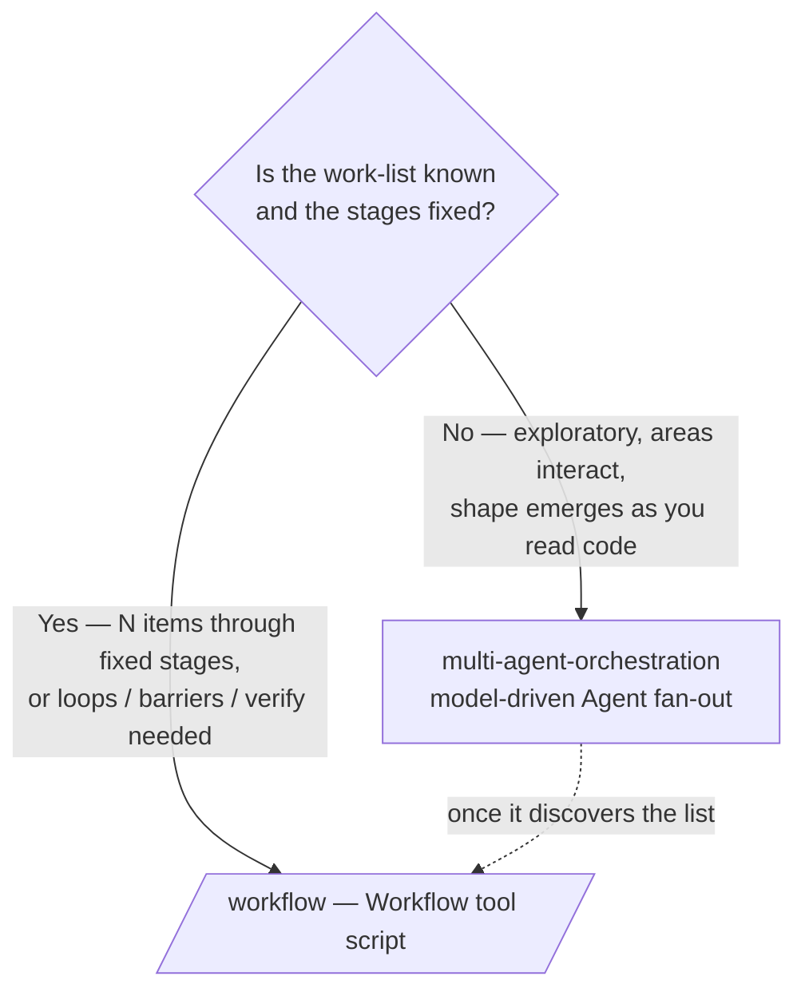

# Workflow authoring for Aegis

This skill is how you turn a request into a **deterministic, reproducible
orchestration** — a JavaScript script run by the `Workflow` tool — instead of an
ad-hoc swarm of `Agent` calls. The script is where you encode the control flow:
what fans out, what pipelines, what verifies, what synthesizes.

It is the deterministic counterpart to
[`multi-agent-orchestration`](../multi-agent-orchestration/SKILL.md). Read
[`docs/adlc.md`](../../../docs/adlc.md) for where workflows sit in the lifecycle
(Build, Review, Improve) and
[`docs/harness-engineering.md`](../../../docs/harness-engineering.md) for where
they sit among the harness primitives.

---

## When to use this skill (vs. the orchestration skill)



**Use `/workflow` when:**

- You have a **known list** to process the same way: review every changed file,
  audit every DB target, size every roadmap item, transform every call site.
- The orchestration needs **real control flow**: a loop until a count/budget, a
  pipeline with no barrier between stages, a barrier where stage N needs *all* of
  stage N-1, an adversarial verify panel.
- You want it **reproducible and resumable** — same script + same args = same run,
  and you can resume a killed run from where it stopped.

**Use the orchestration skill instead when** the work is exploratory and the plan
emerges as agents read the code (a feature where you don't yet know which files
move). The hybrid is common and encouraged: **scout inline first** (or with an
orchestration pass) to discover the work-list, then hand that list to a
`/workflow` script to execute it deterministically.

> **Opt-in.** The `Workflow` tool only runs on explicit opt-in. **Invoking this
> skill is that opt-in** — when this skill is active you may call `Workflow`
> directly. Scale the fan-out to what the user asked for; a quick check is a few
> agents, "audit thoroughly" earns a larger pool with adversarial verify.

---

## Anatomy of a workflow script

Every script is plain **JavaScript** (not TypeScript — no type annotations) and
begins with a pure-literal `meta`:

```js
export const meta = {
  name: 'review-diff',                         // kebab; matches a saved file name
  description: 'One-line purpose (shown in the permission dialog)',
  phases: [                                    // one entry per phase() call
    { title: 'Review' },
    { title: 'Verify' },
  ],
}
// body starts here — top-level await is available
```

The building blocks:

| Hook | What it does |
|------|--------------|
| `agent(prompt, opts?)` | Spawn a subagent. Returns its text, or — with `opts.schema` (a JSON Schema) — a validated object. Returns `null` if the agent is skipped/dies, so `.filter(Boolean)`. |
| `pipeline(items, s1, s2, …)` | Run each item through all stages **independently — no barrier**. Item A can be in stage 3 while B is in stage 1. **The default for multi-stage work.** Each stage gets `(prevResult, originalItem, index)`. |
| `parallel(thunks)` | Run thunks concurrently and **await all (a barrier)**. A throwing thunk resolves to `null`. Use only when stage N needs *all* of stage N-1. |
| `phase(title)` | Group subsequent `agent()` calls under a progress heading. |
| `log(message)` | Emit a narrator line to the user. |
| `args` | The value you passed as Workflow's `args`, verbatim. |
| `budget` | `{ total, spent(), remaining() }` — the turn's token target, for budget-scaled loops. |

`opts` on `agent()`: `label`, `phase` (assign to a group inside
pipeline/parallel — avoids races on global `phase()`), `schema`, `model`,
`effort`, `isolation: 'worktree'`, `agentType` (e.g. a lane-locked
`.claude/agents/` subagent).

**Forbidden in scripts:** `Date.now()`, `Math.random()`, argless `new Date()`
(they break resume) — pass timestamps via `args`, vary by index for randomness.
Standard `JSON`/`Math`/`Array` are fine. No filesystem/Node APIs.

**Caps:** concurrency `min(16, cores−2)`; ≤ 4096 items per `parallel`/`pipeline`
call; 1000 agents per run (a runaway backstop).

---

## Patterns (the toolbox)

- **Adversarial verify** — for each finding, spawn N skeptics prompted to
  *refute* it; keep only what survives a majority. Stops plausible-but-wrong
  findings. (Example 1.)
- **Barrier + synthesize** — `parallel` all workers, then one agent reasons over
  the *whole* result set. Correct only when the synthesis needs everything at
  once. (Example 2.)
- **Read → fan out → schema → rank** — extract a list from a repo file, size each
  item in parallel with a `schema`, synthesize a ranking. (Example 4.)
- **Contract-first pipeline** — freeze a contract, implement lanes in parallel,
  verify, review. (Example 3.)
- **Loop-until** — accumulate to a count or until `budget.remaining()` is low, or
  until K rounds find nothing new (loop-until-dry).
- **Worktree isolation** — for parallel agents that mutate the *same* files (a
  codemod across N call sites), pass `isolation: 'worktree'` so they don't
  clobber each other. Skip it when lanes are disjoint (backend vs. frontend) —
  it's expensive and the changes land in separate worktrees you must merge back.

**Default to `pipeline`.** Reach for a `parallel` barrier only when stage N
genuinely needs all of stage N-1 (dedup across the full set, a zero-count early
exit, "compare against the other findings"). "I need to flatten/filter first" is
*not* a reason — do that inside a pipeline stage.

---

## Aegis example scripts

Copy the closest one. These are runnable; to save one for reuse, drop it in
`.claude/workflows/<name>.js` and call `Workflow({ name: '<name>' })`.

### 1 · `review-diff` — review the working tree, then adversarially verify

The canonical Review-phase workflow. Each Aegis dimension reviews in parallel,
and each finding is refuted-or-confirmed the moment its review lands (pipeline,
no barrier).

```js
export const meta = {
  name: 'review-diff',
  description: 'Review the Aegis working-tree diff across dimensions, adversarially verify each finding',
  phases: [{ title: 'Review' }, { title: 'Verify' }],
}

const FINDINGS = {
  type: 'object',
  properties: {
    findings: {
      type: 'array',
      items: {
        type: 'object',
        properties: {
          title: { type: 'string' },
          file: { type: 'string' },
          line: { type: 'number' },
          severity: { type: 'string', enum: ['P0', 'P1', 'P2', 'P3'] },
          detail: { type: 'string' },
        },
        required: ['title', 'file', 'severity', 'detail'],
      },
    },
  },
  required: ['findings'],
}

const VERDICT = {
  type: 'object',
  properties: { real: { type: 'boolean' }, reason: { type: 'string' } },
  required: ['real', 'reason'],
}

const DIMENSIONS = [
  { key: 'correctness', prompt: 'Run `git diff` and `git diff --staged`. Review for correctness bugs: logic errors, None/null handling, missing await, race conditions. Backend is FastAPI + SQLAlchemy 2.0 + Pydantic v2; frontend is Next.js 15 + React 19.' },
  { key: 'migration', prompt: 'Review the diff for Alembic migration safety: any model change needs a reversible migration, batch-mode for SQLite parity, and must not break the Postgres/MySQL targets. Flag a schema change with no migration as P0.' },
  { key: 'security', prompt: 'Review the diff for Aegis security: JWT stays in the httpOnly aegis_session cookie (never localStorage), rate-limit prefixes intact, no secret logged, body-size cap + FK cascade preserved, every query scoped to the authed user (data isolation).' },
  { key: 'frontend', prompt: 'Review the diff for frontend issues: Zustand store misuse, wrong React Query cache keys, missing loading/error states, hard-coded colors instead of Tailwind v4 theme tokens, accessibility regressions.' },
]

const results = await pipeline(
  DIMENSIONS,
  d => agent(d.prompt, { label: `review:${d.key}`, phase: 'Review', schema: FINDINGS }),
  (review, d) => parallel((review?.findings ?? []).map(f => () =>
    agent(
      `Adversarially verify this ${d.key} finding. Try to REFUTE it against the actual code; ` +
      `default real=false if you cannot confirm it.\n\nTitle: ${f.title}\n` +
      `Where: ${f.file}:${f.line ?? '?'}\nClaim: ${f.detail}`,
      { label: `verify:${f.file}`, phase: 'Verify', schema: VERDICT },
    ).then(v => ({ ...f, dimension: d.key, verdict: v })),
  )),
)

const confirmed = results.flat().filter(Boolean).filter(f => f.verdict?.real)
log(`${confirmed.length} confirmed findings across ${DIMENSIONS.length} dimensions`)
return { confirmed }
```

### 2 · `migration-safety` — audit a migration across every DB target

Aegis supports a 20-target DB matrix (`docs/databases.md`). This is a genuine
**barrier**: the go/no-go synthesis needs *all* per-target audits at once.

```js
export const meta = {
  name: 'migration-safety',
  description: 'Audit the pending Alembic migration against every Aegis database target before it ships',
  phases: [{ title: 'Per-target audit' }, { title: 'Synthesize' }],
}

const AUDIT = {
  type: 'object',
  properties: {
    target: { type: 'string' },
    safe: { type: 'boolean' },
    reversible: { type: 'boolean' },
    issues: { type: 'array', items: { type: 'string' } },
  },
  required: ['target', 'safe', 'reversible', 'issues'],
}

const TARGETS = [
  { db: 'SQLite (dev default)', note: 'no native ALTER COLUMN — Alembic must use batch mode' },
  { db: 'PostgreSQL 13-17 (Neon prod)', note: 'real ALTER, concurrent indexes; watch lock duration' },
  { db: 'MySQL 8 / MariaDB 10.5+', note: 'utf8mb4, row-size limits, index prefix lengths' },
]

phase('Per-target audit')
const audits = (await parallel(TARGETS.map(t => () =>
  agent(
    `Audit the newest migration in backend/alembic/versions/ (the one not yet applied) for ${t.db}. ` +
    `Note: ${t.note}. Confirm upgrade()/downgrade() are symmetric and reversible, batch mode is used ` +
    `where SQLite needs it, and no column type / index / constraint is unsupported here. ` +
    `Read backend/alembic/ and docs/databases.md.`,
    { label: `audit:${t.db}`, schema: AUDIT },
  ),
))).filter(Boolean)

phase('Synthesize')
const verdict = await agent(
  `Per-target migration audits (JSON):\n${JSON.stringify(audits, null, 2)}\n\n` +
  `Give a SHIP / NO-GO verdict. List every blocking issue with its target and a one-line fix. ` +
  `SHIP only if all targets are safe AND reversible.`,
  { effort: 'high' },
)
return { audits, verdict }
```

### 3 · `feature-build` — contract-first build (ADLC Build phase)

Linear with one parallel barrier. Backend and frontend touch **disjoint lanes**,
so no worktree isolation is needed. Pass the brief via `args`.

```js
export const meta = {
  name: 'feature-build',
  description: 'Contract-first Aegis feature build: freeze the contract, implement backend + frontend in parallel, verify, review',
  phases: [{ title: 'Contract' }, { title: 'Implement' }, { title: 'Verify' }, { title: 'Review' }],
}

// args = { feature: 'budget templates (50/30/20)', acceptance: ['user can adopt a template', '...'] }
const feature = args?.feature ?? 'the feature in the latest PM brief'
const acceptance = (args?.acceptance ?? []).map((a, i) => `${i + 1}. ${a}`).join('\n')

phase('Contract')
const contract = await agent(
  `Freeze the API contract for: ${feature}.\nAcceptance:\n${acceptance}\n\n` +
  `Output exact FastAPI endpoint signatures (method, path, Pydantic v2 request/response shapes) and any ` +
  `new SQLAlchemy columns. No implementation. Read backend/app/routers/ and backend/app/schemas/ for conventions.`,
  { agentType: 'Plan' },
)

phase('Implement')
const [backend, frontend] = await parallel([
  () => agent(
    `Implement the BACKEND for "${feature}" behind this frozen contract:\n${contract}\n\n` +
    `Own backend/app/ only. Reversible, batch-mode-safe Alembic migration for any schema change. ` +
    `Pydantic v2 schemas. Do not touch frontend/.`,
    { label: 'impl:backend' },
  ),
  () => agent(
    `Implement the FRONTEND for "${feature}" calling this frozen contract:\n${contract}\n\n` +
    `Own frontend/src/ only. Next.js 15 App Router, Zustand + React Query v5, Tailwind v4 tokens ` +
    `(no hard-coded colors). Do not touch backend/.`,
    { label: 'impl:frontend' },
  ),
])

phase('Verify')
const verify = await agent(
  `Run \`make test\` and report pass/fail with failing assertions. Then list the manual steps to observe ` +
  `each acceptance criterion working in the browser:\n${acceptance}`,
  { label: 'verify' },
)

phase('Review')
const review = await agent(
  `You did NOT implement this. Review the working-tree diff for "${feature}": correctness, lane discipline ` +
  `(backend stayed in backend/app/, frontend in frontend/src/), migration reversibility, and that every ` +
  `acceptance criterion is met. Return a punch list.`,
  { label: 'review', effort: 'high' },
)

return { contract, backend, frontend, verify, review }
```

### 4 · `roadmap-triage` — size and rank the backlog (ADLC Improve phase)

Read a repo file → fan out sizing with a `schema` → synthesize a sprint.

```js
export const meta = {
  name: 'roadmap-triage',
  description: 'Size every post-v1.0 ROADMAP item and rank them into a proposed sprint',
  phases: [{ title: 'Size' }, { title: 'Rank' }],
}

const SIZING = {
  type: 'object',
  properties: {
    item: { type: 'string' },
    area: { type: 'string', enum: ['backend', 'frontend', 'ai', 'ops', 'fullstack'] },
    effort: { type: 'string', enum: ['S', 'M', 'L', 'XL'] },
    risk: { type: 'string', enum: ['low', 'med', 'high'] },
    unblocks: { type: 'array', items: { type: 'string' } },
    rationale: { type: 'string' },
  },
  required: ['item', 'area', 'effort', 'risk', 'rationale'],
}

// args may be an explicit list of items; otherwise extract from ROADMAP.md.
let items = args
if (!Array.isArray(items) || items.length === 0) {
  const extracted = await agent(
    `Read ROADMAP.md and list every concrete post-v1.0 backlog leaf bullet (Smart AI, Feature expansion, ` +
    `Integrations & data, Ops & SRE). One item per line, no prose.`,
    { label: 'extract' },
  )
  items = extracted.split('\n').map(s => s.replace(/^[-*\d.\s]+/, '').trim()).filter(Boolean)
}

phase('Size')
const sized = (await parallel(items.map(item => () =>
  agent(
    `Size this Aegis roadmap item for the v1.0 team (2 backend, 2 frontend, 1 AI, 1 QA, 1 part-time DevOps — ` +
    `see the project-manager skill). Item: "${item}". Read ROADMAP.md and docs/architecture.md. ` +
    `Estimate area, effort (S/M/L/XL), risk, and what it unblocks.`,
    { label: `size:${item.slice(0, 24)}`, schema: SIZING },
  ),
))).filter(Boolean)

phase('Rank')
const sprint = await agent(
  `Sized items (JSON):\n${JSON.stringify(sized, null, 2)}\n\n` +
  `Propose the next 2-week sprint: highest value-per-effort that fits the team, respecting dependencies ` +
  `(an item should come after whatever unblocks it). Output a ranked table and explain the cut line.`,
  { effort: 'high' },
)
return { sized, sprint }
```

---

## Authoring & iterating

- **First run** — pass the script inline via `Workflow({ script: '…' })`. Don't
  Write it to a file first; every invocation auto-persists the script under the
  session dir and returns its path.
- **Iterate** — edit that persisted file with `Edit`/`Write`, then re-invoke with
  `Workflow({ scriptPath: '<path>' })` instead of resending the whole script.
- **Resume** — after a kill or an edit, `Workflow({ scriptPath, resumeFromRunId })`
  replays the unchanged prefix from cache and runs only the edited/new calls.
  Same script + same args ⇒ 100% cache hit.
- **Save for reuse** — move a proven script to `.claude/workflows/<name>.js` and
  call it by name: `Workflow({ name: '<name>', args: … })`. Pass `args` as real
  JSON (`args: ['a', 'b']`), never a stringified list.
- **Watch it run** — `/workflows` shows the live progress tree.

---

## Rules

- **Structured output ⇒ `schema`.** Don't ask an agent to "return JSON" and parse
  it — pass a JSON Schema and the validation happens at the tool layer (the agent
  retries on mismatch). `agent()` returns the validated object.
- **`.filter(Boolean)`** every `parallel`/`pipeline` result before use — a dead or
  skipped agent is `null`, not an exception.
- **`pipeline` by default; barrier only for a true cross-item dependency.**
- **No silent caps.** If you bound coverage (top-N, sampling, no-retry), `log()`
  what you dropped — silent truncation reads as "covered everything".
- **Inherit the model.** Omit `opts.model` unless a tier clearly fits a stage;
  agents inherit the session model. Use `effort: 'high'` for the hard
  verify/synthesize stages, `'low'` for mechanical ones.
- **Dedup against `seen`, not `confirmed`,** in loop-until-dry — else
  judge-rejected findings reappear every round and it never converges.

## Anti-patterns

- ❌ A `parallel` barrier whose next step just flattens/filters — that belongs
  *inside* a pipeline stage.
- ❌ `Date.now()` / `Math.random()` in a script — breaks resume; vary by index or
  pass timestamps via `args`.
- ❌ A non-literal `meta` (variables, spreads, function calls) — it must be a pure
  literal.
- ❌ `isolation: 'worktree'` for disjoint lanes — expensive and the diffs land in
  separate worktrees you have to merge back. Use it only for same-file parallel
  mutation.
- ❌ Reaching for a workflow on exploratory work whose shape isn't known yet — use
  [`multi-agent-orchestration`](../multi-agent-orchestration/SKILL.md), then come
  back with the list.
- ❌ TypeScript syntax (`: string`, generics, interfaces) — scripts are plain JS.

---

## How this fits the ADLC

| ADLC phase | Workflow that fits |
|------------|--------------------|
| **Build** | `feature-build` (contract → parallel lanes → verify → review) |
| **Verify** | `migration-safety` (audit across DB targets before ship) |
| **Review** | `review-diff` (dimensions → adversarial verify) |
| **Improve** | `roadmap-triage` (size → rank the backlog) |

See [`docs/adlc.md`](../../../docs/adlc.md) for the full loop.
