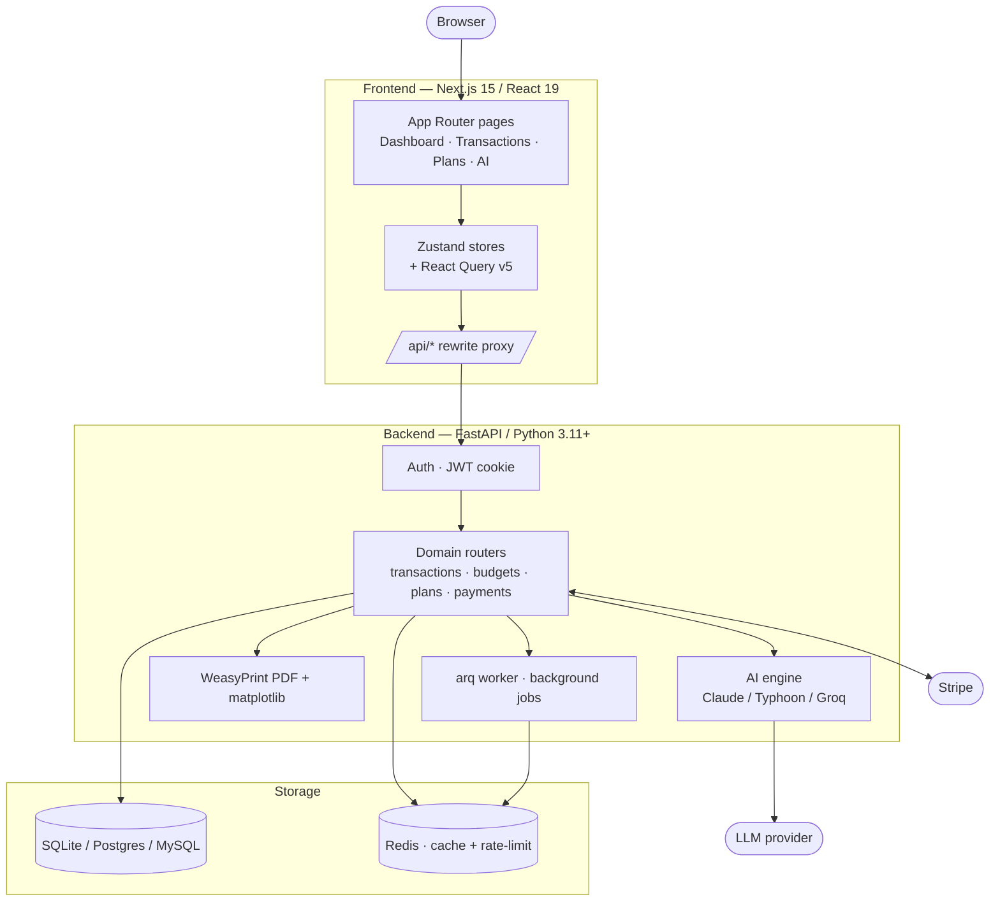
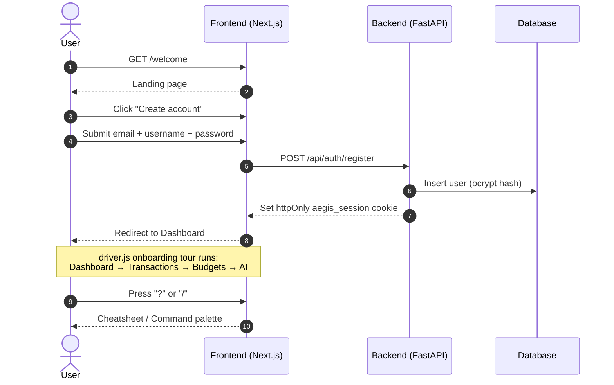
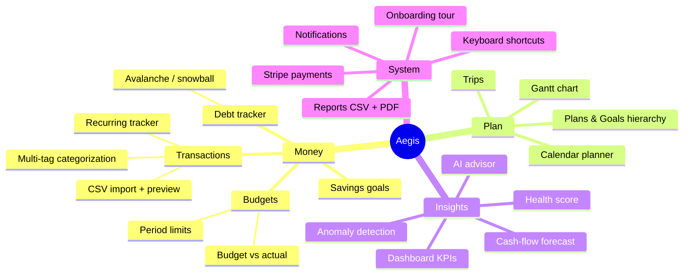
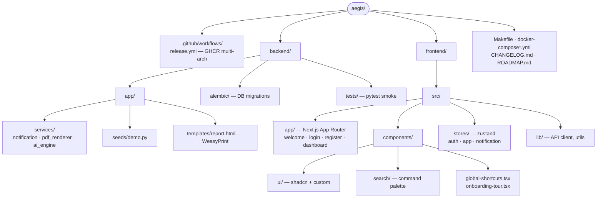

# Aegis — AI-Powered Money Management

AI-powered financial planning with calendar, Gantt charts, cookie-session auth, Stripe payments, keyboard-first navigation, PDF reports, and smart recommendations powered by Claude, Typhoon, or Groq.

Status: **v1.0.0 GA + post-v1 hardening pass shipped.** See [CHANGELOG.md](CHANGELOG.md) — the `[Unreleased]` section covers security (httpOnly cookies, Google sign-in, FK cascade, body-size cap), multi-DB compatibility, the cache layer, and a full performance pass (SQL aggregation, composite indexes, Recharts code-split, gzip). [ROADMAP.md](ROADMAP.md) tracks longer-term direction.

Public landing page: [`/landing`](http://localhost:3000/landing). Sign-in: email/password or **Google** (configurable via `GOOGLE_OAUTH_CLIENT_ID`).

## Architecture at a glance



## Tech Stack

| Layer       | Technology                                                              |
|-------------|-------------------------------------------------------------------------|
| Backend     | Python 3.11+, FastAPI (lifespan + pure-ASGI middleware), SQLAlchemy 2.0, Pydantic v2 |
| Database    | SQLite (dev) / Postgres 13–17 / MySQL 8 / MariaDB 10.5+ / managed equivalents — see [`docs/databases.md`](docs/databases.md) for the 20-target compatibility matrix |
| Migrations  | Alembic with batch-mode for SQLite parity                               |
| Cache       | Pluggable (memory / Redis / disabled) — `CACHE_BACKEND` env             |
| Auth        | JWT (HS256) in httpOnly `aegis_session` cookie + bcrypt + Google Identity Services ID-token flow |
| Rate limit  | Redis-backed fixed-window (falls back to in-memory) with per-route strict prefixes |
| AI          | Anthropic Claude / Typhoon / Groq — `AI_PROVIDER` env                   |
| Payments    | Stripe test + live, webhooks, redirects from `FRONTEND_URL`             |
| Reports     | WeasyPrint (PDF) + matplotlib (server-side charts)                      |
| Exports     | NDJSON streaming for downstream warehouses — see [`docs/analytics-warehouses.md`](docs/analytics-warehouses.md) |
| Frontend    | Next.js 15, React 19, TypeScript                                        |
| Styling     | Tailwind CSS v4, shadcn/ui, 3 cosmic themes                             |
| Charts      | Recharts (dynamic-imported on dashboard for −43% First Load JS)         |
| State       | Zustand (no JWT in localStorage) + TanStack React Query v5              |
| UX          | `driver.js` onboarding + `react-hotkeys-hook` shortcuts                 |
| Hardening   | `GZipMiddleware`, request-body-size cap, FK `ON DELETE CASCADE`, statement timeouts |
| CI/CD       | GitHub Actions: pytest matrix (SQLite × Postgres × py3.11/12) + Trivy SARIF + GHCR multi-arch (`amd64` + `arm64`) |

## Quick Start

### Deploy to Vercel (default)

The root [`vercel.json`](vercel.json) is already wired for Vercel's `experimentalServices` mode — both the Next.js frontend AND the FastAPI backend run on Vercel, with Neon for Postgres.

```bash
# Provision a Neon Postgres at https://neon.tech and copy the pooler URL.
vercel deploy            # links the project + builds + deploys
vercel env add DATABASE_URL production    # paste the Neon URL
vercel env add JWT_SECRET_KEY production  # openssl rand -hex 32
vercel --prod            # promote to production
```

Full step-by-step runbook: [`docs/deployment/vercel.md`](docs/deployment/vercel.md). The trade-off vs Docker is documented — PDF export, the background worker, and AI calls > 10 s are disabled on Vercel Hobby (the latter works on Pro).

### Run locally with Docker

```bash
cp .env.example .env
openssl rand -hex 32 >> .env    # paste as JWT_SECRET_KEY

docker compose up -d            # production-ish
# or, for hot reload:
make dev
```

Frontend: http://localhost:3000 • Backend: http://localhost:8000

The default `DATABASE_URL` is SQLite so you can run end-to-end with zero infra.

### Or run natively via `make`

```bash
make migrate      # alembic upgrade head
make seed         # populate with demo@aegis.local + 120 days of data
make backend      # uvicorn --reload
make frontend     # bun run dev
make test         # backend pytest
```

WeasyPrint (for PDF export) needs Cairo / Pango. On Debian / Ubuntu: `sudo apt-get install -y libpango-1.0-0 libpangoft2-1.0-0 libcairo2 libgdk-pixbuf-2.0-0 libffi-dev`. On macOS: `brew install pango cairo gdk-pixbuf libffi`. The GHCR image bakes these in.

### Published images (GHCR)

After `git tag v1.0.0 && git push --tags`, the `release.yml` workflow publishes:

```
ghcr.io/santapong/aegis-backend:1.0.0
ghcr.io/santapong/aegis-frontend:1.0.0
```

## First-time user flow



1. Open http://localhost:3000/welcome for the landing page, or jump straight to `/register`.
2. Register with email + username + password (≥8 chars).
3. Log in — the JWT is stored in the Zustand auth store.
4. The **onboarding tour** walks you through Dashboard → Transactions → Budgets → AI Advisor on first login. Skip it or replay it from **Settings → Preferences → Restart tour**.
5. Press <kbd>?</kbd> anytime for the shortcut cheatsheet; <kbd>/</kbd> opens the global command palette.

Or, to explore with pre-loaded data:

```bash
make seed
# then log in with: demo@aegis.local / demo-password-123
```

## Features



- **Landing** — public `/welcome` marketing page (chrome-less, CTA to register).
- **Dashboard** — KPI cards, spending charts, financial health score, cash-flow forecast, AI-generated insights.
- **Transactions** — CRUD, CSV import with preview, recurring / subscription tracker, multi-tag categorization, free-text search (`?q=`).
- **Budgets** — period-based limits with budget-vs-actual comparison.
- **Savings Goals** — target tracking with contributions.
- **Debt Tracker** — avalanche / snowball payoff strategies with interest calculations.
- **Plans & Goals** — hierarchical financial plans with progress tracking.
- **Calendar Planner** — monthly / weekly views, drag-drop rescheduling.
- **Gantt Chart** — timeline visualization with zoom levels, mobile touch scrolling.
- **Reports** — category comparison, trend analysis, CSV **and PDF** export (WeasyPrint).
- **Payments** — Stripe test-mode checkout with webhook-driven status updates.
- **AI Advisor** — spending analysis, budget recommendations, 6-month forecasting, weekly summary.
- **Notifications** — server-backed budget / bill / goal / anomaly alerts with idempotent dedupe keys.
- **Onboarding tour** — first-run walkthrough (`driver.js`), replayable from Settings.
- **Keyboard shortcuts** — `N` new, `/` search, `?` cheatsheet, `g d/t/b/c/r` navigation.
- **Docs** — in-app `/docs` page with API reference and user guide.

## Keyboard shortcuts

| Key | Action |
|-----|--------|
| `N` | New transaction |
| `/` | Open command palette / focus search |
| `?` | Show cheatsheet |
| `g d` | Go to dashboard |
| `g t` | Go to transactions |
| `g b` | Go to budgets |
| `g c` | Go to calendar |
| `g r` | Go to reports |
| `Esc` | Close dialog / palette |

## API Docs

When `DEBUG=true`:

- Swagger UI: http://localhost:8000/api/docs
- ReDoc:      http://localhost:8000/api/redoc

In production (`DEBUG=false`) these are disabled.

## MCP server (`aegis-mcp`)

Aegis ships a stdio MCP server that exposes the 18 most-useful tools
(transactions, budgets, plans, trips, dashboard, AI advisor) to any MCP
client — Claude Desktop, Claude Code, or Cursor. It runs in-process and
queries the same database as the FastAPI backend.

Local-trust model: the server resolves the user via `AEGIS_USER_EMAIL`
instead of a short-lived JWT, since the binary spawns as a child process of
your MCP client and already shares the same machine.

### Claude Desktop

Add to `claude_desktop_config.json`:

```json
{
  "mcpServers": {
    "aegis": {
      "command": "uv",
      "args": ["run", "--project", "/abs/path/to/Aegis/backend", "aegis-mcp"],
      "env": {
        "AEGIS_USER_EMAIL": "you@example.com",
        "DATABASE_URL": "sqlite:////abs/path/to/Aegis/money_management.db",
        "JWT_SECRET_KEY": "match-the-backend"
      }
    }
  }
}
```

### Claude Code

```bash
claude mcp add aegis -- uv run --project ./backend aegis-mcp
```

Then in a session try: "list my trips", "show this month's budget vs actual",
"create a trip called Bangkok May 2026 from May 20 to May 27".

## Testing

```bash
make test
# or:
cd backend && uv pip install -e '.[test]' && pytest
```

Smoke tests live in `backend/tests/test_smoke.py` and cover `/api/health` plus the register → login → authorized-request flow.

## Deployment

Aegis is designed Vercel-first: the root [`vercel.json`](vercel.json) configures Vercel's `experimentalServices` mode so a single `vercel deploy` ships both the Next.js frontend and the FastAPI backend. Five recipes are documented in [`docs/deployment/`](docs/deployment/):

| Recipe | Frontend | Backend | DB | ~Monthly cost |
|--------|----------|---------|-----|---------------|
| [**Vercel (all-in)**](docs/deployment/vercel.md) **(default)** | Vercel | Vercel serverless Python | Neon | **$0** Hobby |
| [Vercel + Render](docs/deployment/vercel-render.md) | Vercel | Render / Fly / Railway | Neon | $7 |
| [AWS](docs/deployment/aws.md) | Vercel / Amplify / container | App Runner / ECS Fargate | RDS Postgres | $25–60 |
| [GCP](docs/deployment/gcp.md) | Vercel / Firebase / Cloud Run | Cloud Run | Cloud SQL | $0–25 |
| [Self-hosted](docs/deployment/self-hosted.md) | Same VPS | Same VPS | Same VPS | $5–20 |

Each recipe is a step-by-step runbook with env-var lists, smoke tests, and rollback notes. Start with the [overview](docs/deployment/README.md) if you're unsure which to pick. The Vercel + Render recipe includes a **UAT acceptance checklist** covering auth, data isolation, cookie attrs, rate-limit, body-size cap, FK cascade, exports, and observability — runnable before inviting external testers.

For tutorials covering the user-facing flows + operator concerns, see [`docs/tutorials/`](docs/tutorials/) (getting started, CSV import, AI assistant, deploy-production, caching). For performance work still on the backlog, see [`docs/PERFORMANCE_BACKLOG.md`](docs/PERFORMANCE_BACKLOG.md).

The repo includes:

- A [`build-and-push.yml`](.github/workflows/build-and-push.yml) workflow that pushes both images to GHCR on every `main` push (plus optionally ECR and Artifact Registry when the right secrets are set).
- Make targets — `make image-backend`, `make image-frontend`, `make push-ghcr OWNER=…`, `make push-ecr REGION=… ACCOUNT=…`, `make push-gar REGION=… PROJECT=… REPO=…`, `make deploy-vercel`.
- Per-service `.env.example` files: [`frontend/.env.example`](frontend/.env.example), [`backend/.env.example`](backend/.env.example).
- A [`frontend/vercel.json`](frontend/vercel.json) that pins the framework and root directory for Vercel imports.

## Directory layout



## License

MIT — see [LICENSE](LICENSE).
