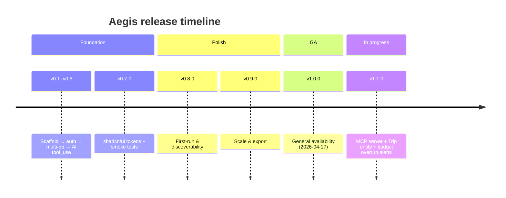
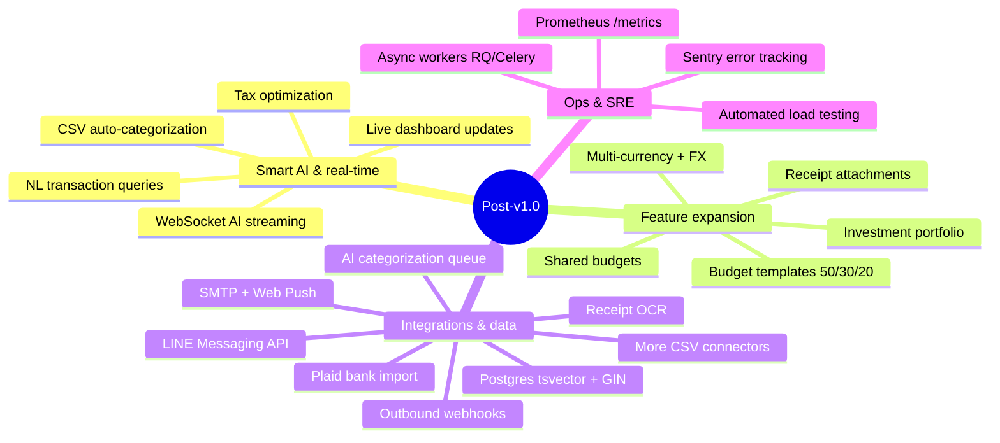
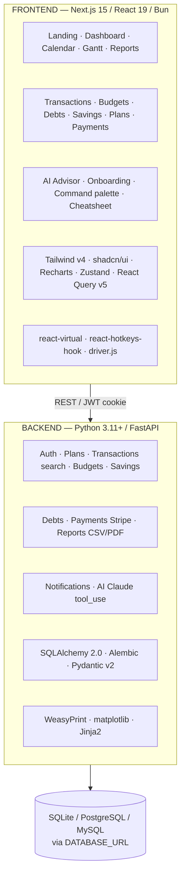

# Aegis — Roadmap

This roadmap reflects the project state as of **v1.0.0** (2026-04-17). See
[CHANGELOG.md](CHANGELOG.md) for the full release history.

Current status: **generally available**.

---

## Release map

| Release | Theme | Status |
|---------|-------|--------|
| v0.1 – v0.6 | Scaffold → auth → multi-db → AI tool_use | ✅ Shipped |
| v0.7.0 | shadcn/ui tokens + smoke tests | ✅ Shipped |
| v0.8.0 | First-run & discoverability | ✅ Shipped |
| v0.9.0 | Scale & export | ✅ Shipped |
| **v1.0.0** | **General availability** | ✅ **Shipped** |
| v1.1.0 | MCP server + Trip entity + budget overrun alerts | 🚧 In progress |

---

## Post-v1.0 direction

Captured here for continuity; not scoped.

### Smart AI & real-time
- WebSocket streaming for the AI advisor (replace current request/response).
- Natural-language transaction queries ("how much did I spend on food last month?").
- AI auto-categorization of imported CSV rows.
- Tax optimization suggestions based on transaction categories.
- Live dashboard updates when transactions are added from another session.

### Feature expansion
- Investment portfolio (stocks / ETF / crypto) with price feeds.
- Budget templates (50/30/20, zero-based) that users can adopt with one click.
- Multi-currency with daily FX conversion.
- Receipt / attachment upload per transaction (image storage).
- Shared budgets between users (household mode).

### Integrations & data
- Plaid / bank-API auto-import.
- Receipt OCR from uploaded images.
- Email / push notifications (SMTP + Web Push).
- **Outbound webhooks** — generic delivery channel for budget/anomaly/bill events (follow-up to v1.1 MCP work).
- **LINE Messaging API** — push notifications and a chat-driven expense logger (requires user-settings token storage + background task system).
- **AI auto-categorization with review queue** — the "correct useful data" loop on top of the CSV importer.
- Additional CSV connectors for common Thai / UK / EU banks.
- Postgres `tsvector` + GIN index upgrade for transaction search (replaces the v0.8 `ILIKE` MVP).

### Ops & SRE
- Horizontal scale via async workers (RQ or Celery) for heavy AI / PDF jobs.
- Prometheus `/metrics` endpoint.
- Structured error tracking (Sentry).
- Automated load testing against a seeded demo DB.

---

## Architecture snapshot (current)

## Tech stack

| Layer      | Technology                                                      |
|------------|-----------------------------------------------------------------|
| Backend    | Python 3.11+, FastAPI, SQLAlchemy 2.0, Pydantic v2, Alembic      |
| Database   | SQLite / PostgreSQL 16 / MySQL                                   |
| Auth       | JWT (HS256) + bcrypt                                             |
| AI         | Claude API (`tool_use` structured output)                        |
| Payments   | Stripe test mode                                                 |
| Reports    | WeasyPrint (PDF) + matplotlib + Jinja2                           |
| Frontend   | Next.js 15, React 19, TypeScript, Bun                            |
| Styling    | Tailwind CSS v4, shadcn/ui (Radix primitives)                    |
| State      | Zustand + TanStack React Query v5                                |
| Perf       | `@tanstack/react-virtual`                                        |
| UX         | `driver.js` + `react-hotkeys-hook`                               |
| Charts     | Recharts                                                         |
| DevOps     | Docker Compose, GitHub Actions (GHCR multi-arch release)         |
