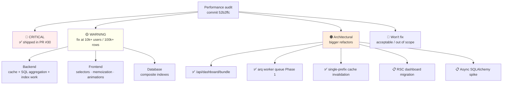
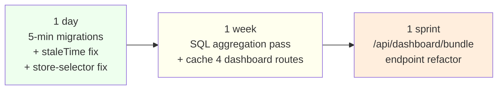

# Performance backlog

Tracks performance work from the audit at commit `52b2ffc` that wasn't shipped in PR #30 (the CRITICAL-only pass). Ordered by impact × effort ratio. A second audit pass (2026-06) is tracked in its own section at the bottom.

The CRITICALs are landed; what's below is **fine today**, breaks at 10k+ users or 100k+ rows.

## Status overview

## 🟡 WARNINGs — fix at scale

### Backend

- [x] **Cache the 4 remaining dashboard endpoints** — `/dashboard/health-score`, `/dashboard/cashflow-forecast`, `/ai/insights`, `/ai/weekly-summary`. ✅ Shipped: all wired into `_DASHBOARD_CACHE_SCOPES` and invalidated on transaction mutation.
- [x] **SQL aggregation pass on the remaining materialize-then-aggregate routes** — ✅ Shipped: `dashboard.health_score` (was 5–14 queries, now 4 aggregate queries), `dashboard.cashflow_forecast` (was all-time scan, now 2 aggregate queries), `ai.weekly_summary` (was 2 full scans + 4 Python loops, now 3 aggregate queries), `reports.category_comparison` (was N month-scans, now 1 GROUP BY). `budgets.budget_comparison` and `ai.get_insights` still on the list — the latter is just cached for now since its logic is complex.
- [x] **`notification_service.evaluate_budget_thresholds` fires on every transaction mutation** — ✅ Shipped: replaced per-budget `.all()` + Python sum with `COALESCE(SUM(amount), 0)` SQL scalar.
- [x] **`/api/reports/export.{csv,pdf}` have no `LIMIT`** — ✅ Shipped: CSV capped at 50k rows (configurable `?limit=`, max 100k), PDF capped at 5k rows.
- [x] **`budgets.budget_comparison`** — ✅ Shipped: replaced `.all()` + Python group with one GROUP BY query (≤ ~30 rows regardless of window size).
- [x] **`ai.get_insights` SQL aggregation** — ✅ Shipped: two aggregate queries with a CASE-based bucket column gives totals + per-category breakdown for both current and prior month in 2 round-trips instead of 2 full scans.
- [x] **CSV import uses pandas** — ✅ Shipped: rewritten with `csv.DictReader` (streaming, constant memory) + helper `_money()` for the bank-export format zoo. pandas removed from `pyproject.toml` entirely (~30 MB cold-start saving); matplotlib keeps numpy as a transitive dep for the PDF chart renderer.
- [x] **Sync handlers share one threadpool** — ✅ Shipped the quick fix: Dockerfile bumped `--workers` from 2 to 4 with a note explaining the DB-pool math at scale. Worker-queue refactor (Celery / Render cron) still in the architectural backlog if you outgrow this.
- [x] **Anomaly detection bounded** — ✅ Shipped: two-step now (one GROUP BY for per-category averages, then a single bounded query for outliers using OR-of-category clauses). Stops loading every expense in a 90-day window for power users.

### Frontend

- [x] **Page-level `useAppStore()` subscription on the dashboard** — ✅ Shipped: dashboard and settings pages now use per-field selectors.
- [x] **Transactions filter object identity** — ✅ Shipped: `queryParams` wrapped in `useMemo`.
- [x] **Manage-tags modal O(tags × txns × txn.tags)** — ✅ Shipped: `tagUsageById` memoized as a `Map<tagId, count>` built once per data refresh; modal reads `O(1)` per tag.
- [x] **Calendar `getEventsForDay` called inside 42-cell day grid per render** — ✅ Shipped: O(events) walk once per `events` change, then `Map<dayKey, CalendarEvent[]>` lookups in render.
- [x] **Anomaly / insight cards re-fire entry stagger animation on every refetch** — ✅ Shipped: gated via `hasMounted` state — `initial={false}` and `duration: 0` after first paint, so refetches snap-in instantly.
- [x] **TrendChart re-mounts the 1 s Recharts entry animation on every refetch** — ✅ Shipped: `isAnimationActive={animate}` where `animate` flips false 1.1 s after first paint.
- [x] **Driver.js (onboarding) and Stripe.js in shared client bundle** — ✅ Verified: driver.js is already `await import("driver.js")` in `onboarding-tour.tsx:75` (only the small CSS file stays static). Stripe.js is NOT in the bundle — the frontend uses Stripe's redirect-checkout flow (`window.location.href = checkout_url`), so no `@stripe/stripe-js` import. Audit was being cautious; both items were already resolved.
- [x] **React Query `staleTime: 30_000` doesn't align with backend cache TTL=60s** — ✅ Shipped: `staleTime: 60_000` + `refetchOnWindowFocus: false` in `providers.tsx`.

### Database

- [x] **`transactions(user_id, category)` index** — ✅ Shipped (v0.9.8 migration).
- [x] **`budgets(user_id, period_start)` composite index** — ✅ Shipped (v0.9.8 migration).
- [x] **`ai_recommendations(user_id, created_at)` composite index** — ✅ Shipped (v0.9.8 migration).
- [ ] **Connection pool math at 2+ Render pods exceeds Neon free tier cap** — drop `db_pool_size` to 5 OR migrate to Neon's pooler endpoint (`-pooler.neon.tech`). *~10 min config change.* Documented in `docs/deployment/vercel-render.md`.

## 🟠 Architectural concerns — bigger refactors

### ~~`GET /api/dashboard/bundle`~~ ✅ Shipped

`GET /api/dashboard/bundle` returns summary + charts + health-score + cashflow-forecast + anomalies + AI weekly-summary + AI insights in one response. Backend caches the bundle under `dashboard:bundle:<user_id>` (registered in `_GLOBAL_USER_SCOPES` so all mutation routes invalidate it). Frontend dashboard switched from 6 `useQuery` calls to 1. AI bits degrade gracefully to `null` / `[]` when the provider isn't configured.

### ~~Move long-running routes to a worker queue~~ ✅ Phase 1 shipped

arq + Redis worker queue. `POST /api/reports/export.pdf?background=true` enqueues; `GET /api/jobs/{id}/status` polls; `GET /api/jobs/{id}/download` streams the result. Backward compatible — falls back to inline rendering when `CACHE_REDIS_URL` isn't set. Docker Compose ships a `worker` service running `arq app.worker.WorkerSettings`. Frontend `exportPDFAsync()` wraps the poll loop with a 5-minute timeout.

Phase 2 (AI summary on the queue) is straightforward — register a second arq task in `app/worker.py` and flip the AI endpoints to enqueue. Defer until you actually feel the threadpool pressure on AI calls.

### ~~Single-prefix user cache invalidation~~ ✅ Shipped

Resolved via `backend/app/cache.py:_GLOBAL_USER_SCOPES` + `invalidate_user_all(user_id)`. New cached endpoints register their scope name once at module-load time; every mutation route automatically picks it up. Transactions router was migrated from per-router scope list to the new helper.

### Frontend → React Server Components for dashboard
Even with the 6-endpoint dashboard collapsed, TTFB-to-data could drop ~150 ms by inlining the bundle response server-side.

- **Win**: ~150 ms LCP improvement on Vercel + Render
- **Cost**: ~1 day for the disciplined split (not "convert every widget" — only the data-loading boundary moves to RSC)
- **When**: when dashboard cold-start becomes a user complaint
- **Design doc**: [`docs/design/003-rsc-dashboard-migration.md`](design/003-rsc-dashboard-migration.md) — covers the cookie-forwarding wiring, full migration plan, and the security tradeoff that gates the spike.

### ~~Async SQLAlchemy~~ 📋 Infrastructure shipped, spike in `export.py`

`get_async_engine()` + `get_async_db()` factory landed in `database.py`. New routes can opt in by declaring `async def …(db: AsyncSession = Depends(get_async_db))`. Sync engine stays the default; the two coexist with independent pools.

`backend/app/routers/export.py` converted as the worked-example spike — uses `select() + stream_scalars()` for true cursor streaming under async.

Full repo migration (every router → async) intentionally NOT shipped. Cost-benefit analysis + per-router migration recipe in [`docs/design/002-async-sqlalchemy-migration.md`](design/002-async-sqlalchemy-migration.md). TL;DR: don't migrate until you're at 500+ concurrent users; worker queue solves the real threadpool problem first.

## What's NOT on the backlog

Things the audit flagged that we explicitly won't fix:

- **Vercel rewrite latency overhead (~30–80ms RTT)** — acceptable for non-streaming responses. Direct CORS to backend would add complexity for marginal win. Reconsider only if AI streaming moves to SSE.
- **Lucide React tree-shaking** — already optimal, no action.
- **`metadata_json` JSON column on `Payment`** — never queried by key predicate; portable JSON is the right choice. Don't add GIN/JSONB until a query predicate appears.

## Sequencing

If you have 1 day: pick the 5-minute migrations + React Query staleTime + the page-level store-selector fix. Stops the easy bleed.

If you have 1 week: ship the SQL aggregation pass on the 4 remaining dashboard routes + cache them. Solves "the dashboard feels slow as data grows" before you ever feel it.

If you have a sprint: the `dashboard/bundle` endpoint refactor. Sets up scaling for the next year.

## Second audit (2026-06)

A fresh pass over everything the first audit's CRITICAL/WARNING sweep didn't
reach — secondary pages, services, infra, CI. All shipped unless marked.

### Shipped — frontend

- [x] **Recharts code-split on Budgets + Reports** — the dashboard got the
  `next/dynamic` split in the first pass; these two pages still imported
  Recharts statically (Reports also imported `SpendingChart`/`TrendChart`
  statically). Extracted `budget-comparison-chart.tsx` +
  `category-comparison-chart.tsx` and dynamic-imported everything.
  First Load JS: `/budgets` 271→169 kB, `/reports` 279→164 kB.
- [x] **Payments page → React Query** — was `useEffect`+`useState` with a
  config→list waterfall and a full refetch from offset 0 on every
  "Load more" (which also re-fired the Stripe success toast). Now two
  queries with `placeholderData: keepPreviousData` and `retry: false`
  on the config probe.
- [x] **`keepPreviousData` on Investments / Plans / Trips lists** —
  "Load more" bumps `pageSize` into a new queryKey, which cleared the
  list to a skeleton while refetching. Previous rows now stay on screen.
- [x] **Calendar month cache** — `staleTime: 5 min`, `gcTime: 30 min`,
  `keepPreviousData`; paging back to a visited month no longer refetches.
- [x] **TradingView embeds lazy-mount** — Investments rendered one
  external `<script>` per holding eagerly (O(holdings) network +
  execute). Now IntersectionObserver-gated (200 px rootMargin) +
  `memo()` so parent re-renders don't re-inject mounted widgets.
- [x] **Transactions desktop row memoized** — typing in the create/edit
  modal re-rendered all rows (up to `limit=500`) per keystroke.
  `TransactionRow` is `memo()`-ed with a `useCallback` edit handler.
- [x] **Reports category-breakdown sort memoized.**

### Shipped — backend

- [x] **AI SDK clients cached per credential set** — `AIEngine.__init__`
  built a fresh `anthropic.Anthropic()` / `OpenAI()` per request: new
  httpx pool + TLS handshake every AI call (~50–100 ms). Now
  `@lru_cache` module-level factories.
- [x] **`trips.trip_summary` SQL aggregation** — was materialize-then-sum
  over every trip budget + expense row; now two `GROUP BY category`
  queries (same rewrite as `budgets.budget_comparison`).
- [x] **`AIEngine._gather_context` SQL aggregation** — was loading every
  transaction in the 90-day window and summing in Python on every AI
  call; now one CASE-bucket totals query + one `GROUP BY category`,
  and the plans query filters `status IN (planned, in_progress)` in SQL.
- [x] **In-memory rate limiter GC amortized** — the size probe
  (`sum(len(v) for v in buckets)`) ran on *every* request, O(unique
  clients); now every 256th hit.
- [x] **`uvicorn[standard]`** — uvloop + httptools event loop/parser.
- [x] **`notifications(user_id, created_at)` composite index** (v0.9.9
  migration) — the list endpoint's `ORDER BY created_at DESC` sorted the
  user's whole history; `(user_id, read_at)` only covered the unread
  count.

### Shipped — infra / CI

- [x] **CI lockfile mismatch** — `deploy-vercel.yml` and `test.yml`
  pointed setup-node's npm cache (and `npm ci`) at
  `frontend/package-lock.json`, which doesn't exist (repo uses
  `bun.lock`) — the frontend jobs failed at setup. Deploy job drops the
  cache (it only installs the Vercel CLI); test job now uses
  `oven-sh/setup-bun` + `bun install --frozen-lockfile`.
- [x] **v0.9.5 migration broken on SQLite + alembic ≥1.16** —
  `batch.drop_index(if_exists=True)` is rejected by the batch-recreate
  path, and the try/except guards around batch ops never caught
  flush-time errors. Rewritten with inspector-based existence checks
  (also portable to MySQL, which lacks `DROP INDEX IF EXISTS`).
- [x] **ruff/bandit into `[dev]` extra** — were `pip install`-ed fresh
  outside the cached env every CI run.
- [x] **Editable-install packaging fix** — `uv pip install -e .` failed
  with "Multiple top-level packages" (flat layout: `app/` + `alembic/`);
  pinned `[tool.setuptools.packages.find] include = ["app*"]`.
- [x] **Compose healthcheck cadence** — backend probe (Python
  interpreter + HTTP + `SELECT 1`) every 10 s forever → 30 s steady-state
  with `start_interval` keeping boot gating fast; db/redis 5 s → 10 s.
- [x] **Redis memory bound** — `--maxmemory 96mb --maxmemory-policy
  volatile-lru`: cache keys (always TTL'd) are evictable, arq queue keys
  (no TTL) never are. Don't switch to `allkeys-*` while the queue shares
  the instance.

### Checked and rejected (non-issues)

- **Postgres container tuning** — the official image already defaults
  `shared_buffers=128MB`, the right ~25 % of the 512 M limit. Placebo.
- **Backend Dockerfile layer order** — already correct: builder stage
  installs deps from `pyproject.toml` before the code `COPY . .`.
- **Caddy cache headers / brotli** — Next standalone already serves
  `/_next/static` with `immutable`; Caddy passes it through and already
  does `encode gzip zstd`. Stock Caddy has no brotli module.
- **Notifications items+count query merge** — both queries are
  index-backed after v0.9.9; a window-function merge buys ~2 ms.
- **`get_current_user` short-TTL cache** — deliberate skip (product
  call): the per-request lookup is an indexed PK hit; caching trades
  exact revocation semantics for 1–5 ms. Revisit on remote-DB deploys.

### Still open (carried from first audit)

- 📋 RSC dashboard migration (design doc 003)
- 📋 Full async SQLAlchemy migration (design doc 002)
- 📋 arq Phase 2 — AI summaries on the queue
- 📋 Neon pooler endpoint / `db_pool_size` config at 2+ pods
- 📋 List virtualization (`@tanstack/react-virtual` already in deps)
  if "Load more" pages grow past a few hundred rows
