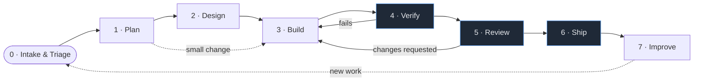
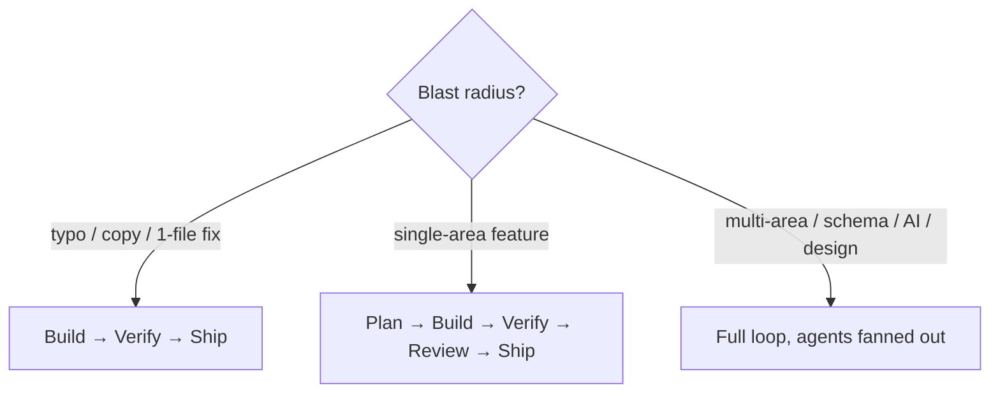
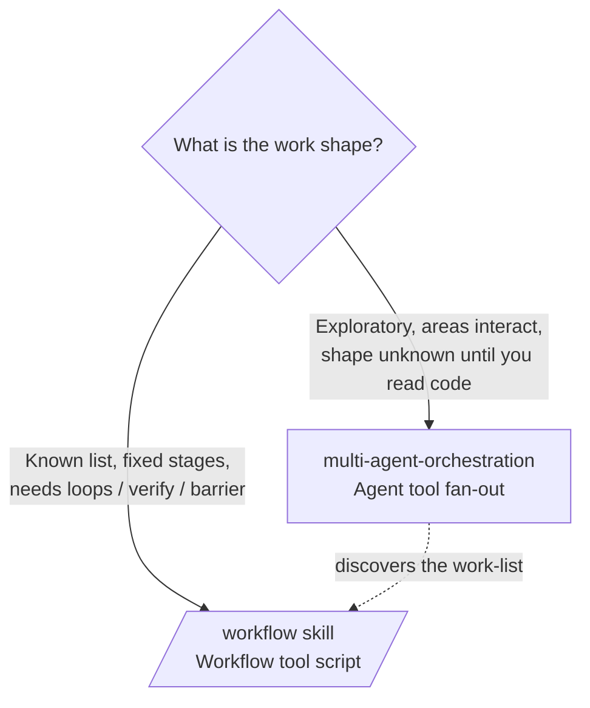

# Aegis — Agentic Development Life Cycle (ADLC)

How work moves through Aegis when **Claude agents are first-class builders**, not
just an autocomplete. The ADLC is a conventional plan → build → ship loop, but
every phase is *owned by a harness primitive* — a [skill](../.claude/skills/),
a subagent type, or a [Workflow](../.claude/skills/workflow/SKILL.md) script —
so the process is executable, not just aspirational.

> **The harness is the lifecycle.** If a phase here has no primitive that drives
> it, that is a gap in the harness, not in the process. See
> [`harness-engineering.md`](harness-engineering.md) for how the primitives are
> built; this doc is about how they compose into a loop.

This sits *above* the existing skills. [`project-manager`](../.claude/skills/project-manager/SKILL.md)
owns Plan + Improve, [`multi-agent-orchestration`](../.claude/skills/multi-agent-orchestration/SKILL.md)
and [`frontend-design-team`](../.claude/skills/frontend-design-team/SKILL.md) own
Build, [`/verify`](#4-verify) and [`/code-review`](#5-review) own the gates. The
ADLC is the spine they all hang off.

---

## The loop

Three of the boxes are **gates** (blue): Verify, Review, Ship. Work only moves
forward through a gate when its exit criteria are met; otherwise it bounces back
to Build. Everything else is a transform that produces an artifact.

---

## Phases

Each phase below lists its **trigger**, the **harness primitive** that drives it,
the **work**, the **exit gate**, and the **artifact** it leaves behind.

### 0 · Intake & Triage

| | |
|---|---|
| **Trigger** | A user ask, a GitHub issue, a `ROADMAP.md` item, or a `<github-webhook-activity>` event (CI failure, review comment). |
| **Driver** | Main thread + [`project-manager`](../.claude/skills/project-manager/SKILL.md) for sizing. |
| **Work** | Classify the request: bug / feature / chore / design / ops. Size it (1-file fix vs multi-area feature). Pick the **lane** and the entry phase — a typo fix enters at Build; a new feature enters at Plan; a "make it pretty" enters at Design. |
| **Gate** | The request is understood well enough to route. If it is genuinely ambiguous (forked requirements, architecturally significant), use `AskUserQuestion` *before* spending agent budget — never guess on a big deliverable. |
| **Artifact** | A one-line routing decision: *"feature, multi-area → Plan"* or *"bug, 1 file → Build"*. |

**Scaling rule.** Most work does **not** traverse all eight phases. Match the
ceremony to the blast radius:

### 1 · Plan

| | |
|---|---|
| **Trigger** | Triage routed a feature or non-trivial change here. |
| **Driver** | [`project-manager`](../.claude/skills/project-manager/SKILL.md) skill, plus a `Plan` subagent for subsystem architecture. |
| **Work** | Produce the PM brief in the skill's exact shape: **goal, acceptance criteria (observable, not aspirational), role assignments with file owners, sequencing (name the one unblocker), risks, out-of-scope.** Decide whether a design doc is needed. |
| **Gate** | Acceptance criteria are observable behaviors. The single unblocking step is identified. Out-of-scope is explicit so reviewers don't scope-creep. |
| **Artifact** | The brief (lives in the PR description) and — for anything that changes schema, the data model, or a subsystem's shape — a stub `docs/design/NNN-*.md`. |

### 2 · Design *(conditional)*

Skip for behavior that fits the existing shape; run for new architecture, new
data model, or any visual change.

| | |
|---|---|
| **Trigger** | The change introduces a new subsystem, a schema migration with semantic weight, a new external dependency, or a visible UI surface. |
| **Driver** | **Architecture** → a design doc in [`docs/design/`](design/) (the existing ADR-style format: *Status · Context · Options table with a verdict · Architecture mermaid · migration/rollback*). **Visual** → the [`frontend-design-team`](../.claude/skills/frontend-design-team/SKILL.md) skill (Design Lead → brief → tokens → implementation order). |
| **Work** | Compare options in a table, pick one with a stated reason, sketch the architecture, name the migration + rollback path. For visual work, produce the one-page brief and the token sheet *before* any page is touched. |
| **Gate** | The design doc has a chosen option with a *reason*, and a reversible migration story. A human (or a separate reviewing agent) has read it. `Status:` is no longer "draft" once approved. |
| **Artifact** | `docs/design/NNN-<slug>.md` and/or a design brief + token sheet. |

> Aegis already has four design docs (`001`–`004`). New ones continue the
> numbering. They are reviewed *before* Build kicks off, not after.

### 3 · Build

| | |
|---|---|
| **Trigger** | Brief approved (and design doc, if any). |
| **Driver** | [`multi-agent-orchestration`](../.claude/skills/multi-agent-orchestration/SKILL.md) when the work is **model-driven and exploratory** (fan out backend/frontend/AI agents, integrate). The [`/workflow`](../.claude/skills/workflow/SKILL.md) skill when the work is **deterministic over a known list** (transform N files, sweep M dimensions, run a fixed pipeline). |
| **Work** | Implement behind the contract from Plan. **Lane discipline:** backend agents touch `backend/app/`, frontend agents touch `frontend/src/`, the design-system Steward is the sole owner of `globals.css`. Hard dependencies use Pattern B (contract → backend → frontend+QA in parallel); independent slices use Pattern A (parallel fan-out). |
| **Gate** | Every lane's diff stays in its lane (no cross-lane drift). Schema change ⇒ a reversible Alembic migration exists (batch-mode for SQLite parity). |
| **Artifact** | Working-tree changes, scoped per lane. |

**Orchestration vs. Workflow — the Build-phase fork:**

The two compose: scout inline or with an orchestration pass to *discover* the
work-list, then hand the list to a `/workflow` script to *execute* it
deterministically.

### 4 · Verify — *gate*

| | |
|---|---|
| **Trigger** | Build reports done. |
| **Driver** | [`/verify`](../.claude/skills/) (run the app, observe real behavior) + `make test` + a QA subagent. |
| **Work** | Run `make test` (pytest matrix). Bring the stack up (`make dev` / `docker compose up`) and exercise the actual change in the browser or via `curl`. Trust `curl` over the UI for auth flows (per [`aegis-troubleshooting`](../.claude/skills/aegis-troubleshooting/SKILL.md)). |
| **Gate** | **Tests green and behavior observed.** A passing test suite is necessary but not sufficient — the change must be seen working. Fails bounce to Build. |
| **Artifact** | Test output + an observation note (or screenshot) in the PR. |

### 5 · Review — *gate*

| | |
|---|---|
| **Trigger** | Verify passed. |
| **Driver** | [`/code-review`](../.claude/skills/) for the diff; a `/workflow` **adversarial-verify** script for high-stakes changes (spawn N skeptics per finding, kill findings a majority refute). |
| **Work** | An agent **other than the implementer** reviews for correctness bugs and reuse/simplification. Apply the per-PR gates from the PM skill: criteria checked, migration reversible, prompt-cache keys reviewed if AI touched, UX sign-off if a button/route/modal changed. |
| **Gate** | Independent reviewer signs off; all PM per-PR gates satisfied. Changes requested bounce to Build. |
| **Artifact** | Review verdict; applied fixes or filed follow-ups. |

> **Never let the implementer self-review.** Rotate the reviewer — a different
> subagent, or `/code-review` run cold against the diff.

### 6 · Ship — *gate*

| | |
|---|---|
| **Trigger** | Review signed off. |
| **Driver** | Main thread + GitHub MCP + CI (`test.yml`, `build-and-push.yml`, `release.yml`). |
| **Work** | Commit with a clear message on the feature branch (never `main`). Push with `-u origin <branch>`. Open a **draft PR**. Update `CHANGELOG.md` `[Unreleased]`. Subscribe to PR activity to babysit CI to green. Tag + `release.yml` for an actual release. |
| **Gate** | **CI green** (pytest SQLite×Postgres×py3.11/12 + Trivy SARIF + GHCR multi-arch build) and every acceptance criterion checked in the PR body. |
| **Artifact** | Merged PR, `CHANGELOG` entry, optionally a version tag → GHCR images. |

### 7 · Improve

| | |
|---|---|
| **Trigger** | Continuous — the PM skill runs this without being asked. |
| **Driver** | [`project-manager`](../.claude/skills/project-manager/SKILL.md) continuous-improvement cadence. |
| **Work** | Weekly: Mon triage `ROADMAP.md`, Wed UX bug-bash, Fri test/release health. Quarterly: model refresh (via [`claude-api`](../.claude/skills/) / `/claude-api`), dependency sweep, perf review, roadmap re-rank. Capture one keep / one change retro per feature. |
| **Gate** | Metrics inside target (p95 < 300 ms, initial JS < 500 KB, `make test` < 60 s, 0 P0 bugs). Misses become new Intake items. |
| **Artifact** | Re-ranked roadmap, new issues, updated metrics — which feed back into phase 0. |

---

## Phase → primitive map

The one-screen cheat sheet for "which part of the harness owns this phase":

| Phase | Primary primitive | Subagent / tool | Gate artifact |
|-------|-------------------|-----------------|---------------|
| 0 Intake | main thread | `AskUserQuestion`, `project-manager` | routing decision |
| 1 Plan | `project-manager` skill | `Plan` agent | PM brief |
| 2 Design | `docs/design/` ADR · `frontend-design-team` | `Plan`, `Explore` | design doc / token sheet |
| 3 Build | `multi-agent-orchestration` · `/workflow` | `Agent` fan-out, `Workflow` | scoped diffs |
| 4 Verify | `/verify` + `make test` | QA `general-purpose` | tests green + observation |
| 5 Review | `/code-review` · adversarial `/workflow` | reviewer `general-purpose` | review verdict |
| 6 Ship | GitHub MCP + CI | webhook subscription | merged PR + CHANGELOG |
| 7 Improve | `project-manager` cadence | `Explore`, `/workflow` triage | re-ranked roadmap |

---

## Worked example — "Budget templates (50/30/20)"

A roadmap item (`ROADMAP.md` → Feature expansion) traced through the loop:

1. **Intake.** Promoted from roadmap on a Monday triage → *feature, multi-area
   (backend rows + frontend one-click adoption) → enter at Plan.*
2. **Plan.** PM brief: *AC — user picks a template, budgets are created for the
   current period, idempotent on re-adopt.* Backend owns `routers/budgets.py` +
   a schema; frontend owns the template picker; no AI. Unblocker: the template
   schema.
3. **Design.** No new subsystem → **skipped.** (Had it needed a new table with
   migration semantics, a `docs/design/005-budget-templates.md` would gate here.)
4. **Build.** Pattern B: a `Plan` agent freezes the Pydantic contract, then a
   backend agent + a frontend agent run in parallel against it. Migration added,
   reversible, batch-mode safe.
5. **Verify.** `make test` green; `curl` the new endpoint; click "adopt" in the
   browser and confirm budgets appear. Re-adopt → no duplicates (idempotency
   observed, not assumed).
6. **Review.** `/code-review` cold on the diff flags a missing unique
   constraint; fixed. PM gate: migration reversible ✓, UX reviewer signs off on
   the picker.
7. **Ship.** Draft PR, CHANGELOG `[Unreleased]` entry, CI green, subscribe to
   babysit.
8. **Improve.** Roadmap item moved to shipped; retro note: *keep the contract-
   first sequencing; change — write the idempotency test first next time.*

---

## Principles

- **Gates are not optional, ceremony is.** A 1-file fix skips Plan/Design/Review
  ceremony but **never** skips Verify (run it) and Ship (CI green).
- **Trust but verify.** After any agent reports done, read the actual diff before
  advancing a phase. A green test suite is the floor, not the proof.
- **One lane per agent.** Cross-lane drift is the most common review reject —
  enforce it in Build, catch it in Review.
- **Deterministic when you can, exploratory when you must.** If the work is a
  known list with fixed stages, a `/workflow` script beats an ad-hoc agent
  swarm — it is reproducible, resumable, and cheaper to reason about.
- **The loop closes.** Improve is not a footnote; it is the edge that feeds
  Intake. Follow-ups go to `ROADMAP.md` or issues, never into a growing PR.
- **Ask before a big wrong turn.** `AskUserQuestion` at Intake costs one round
  trip; a misbuilt feature costs the whole loop.
