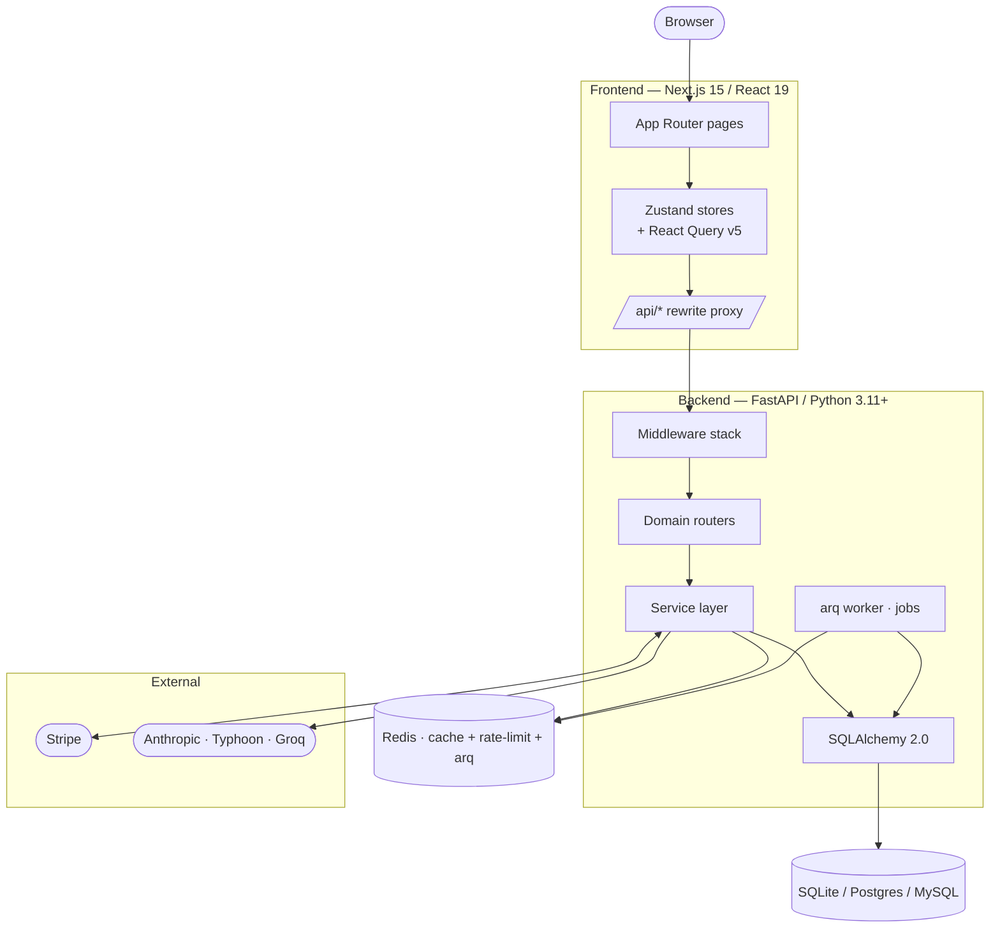
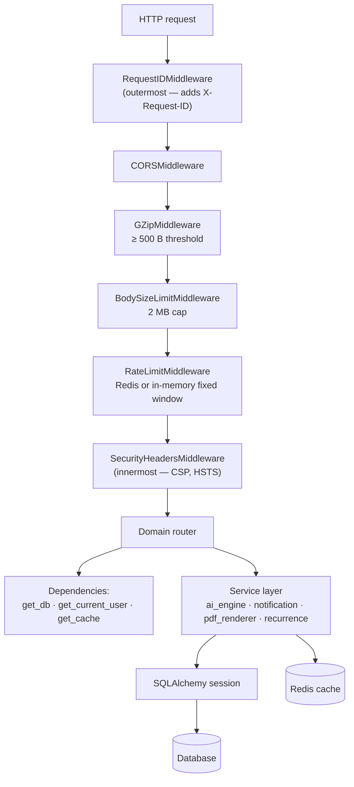
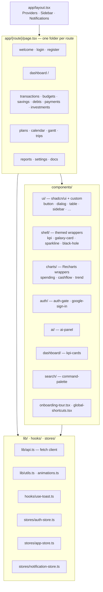
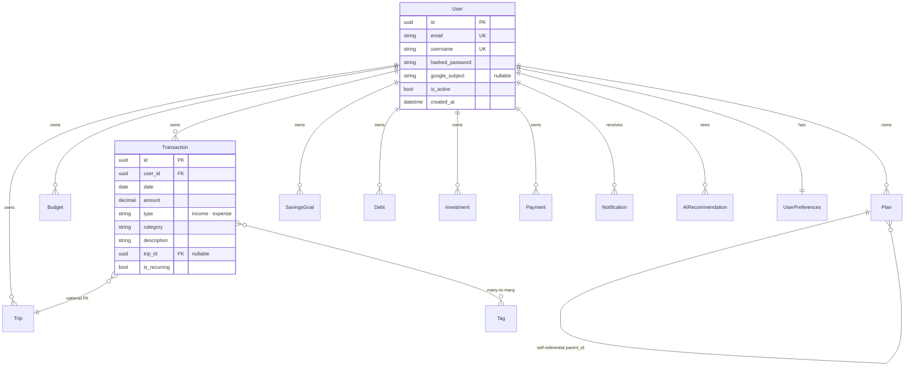
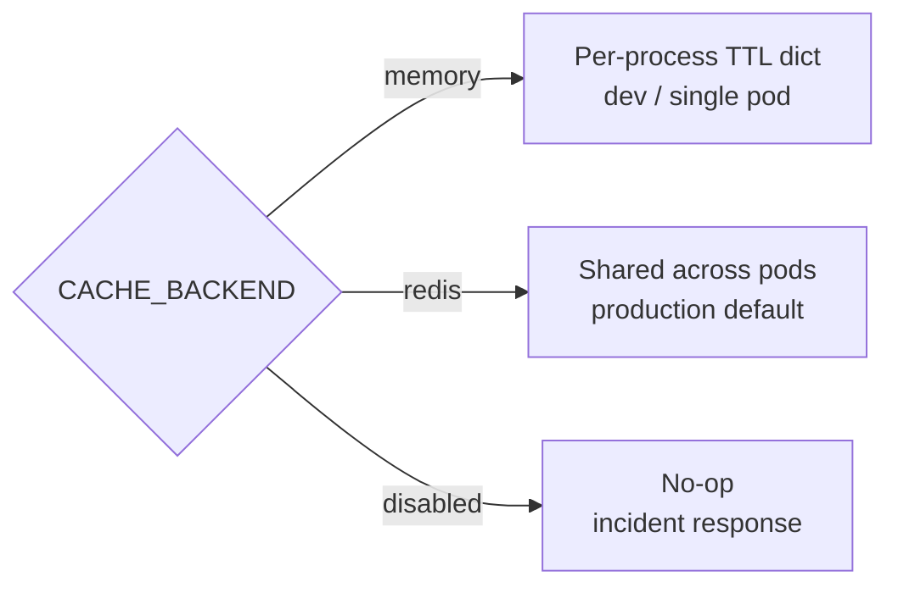
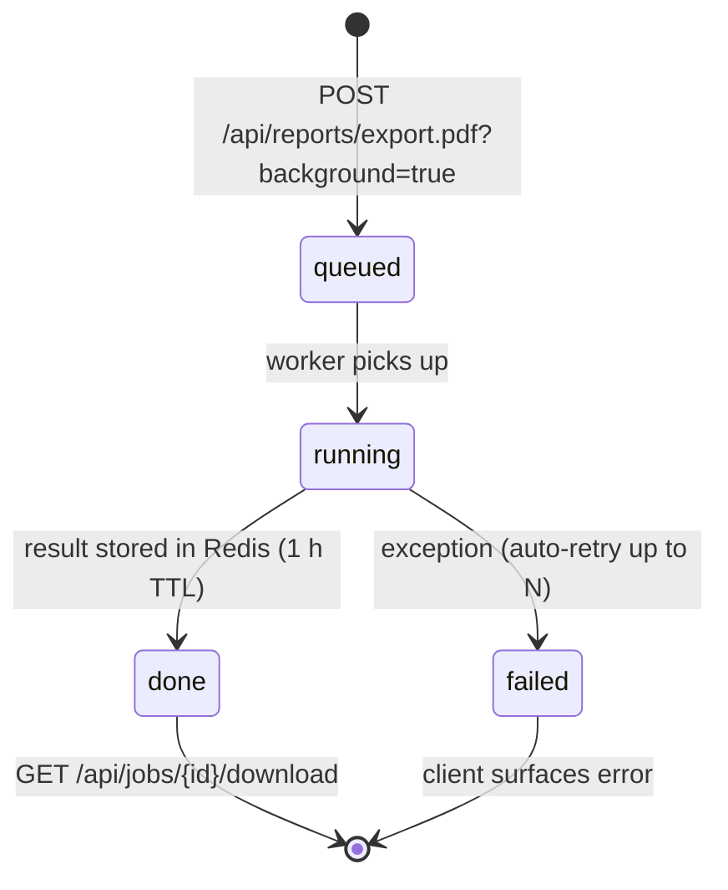
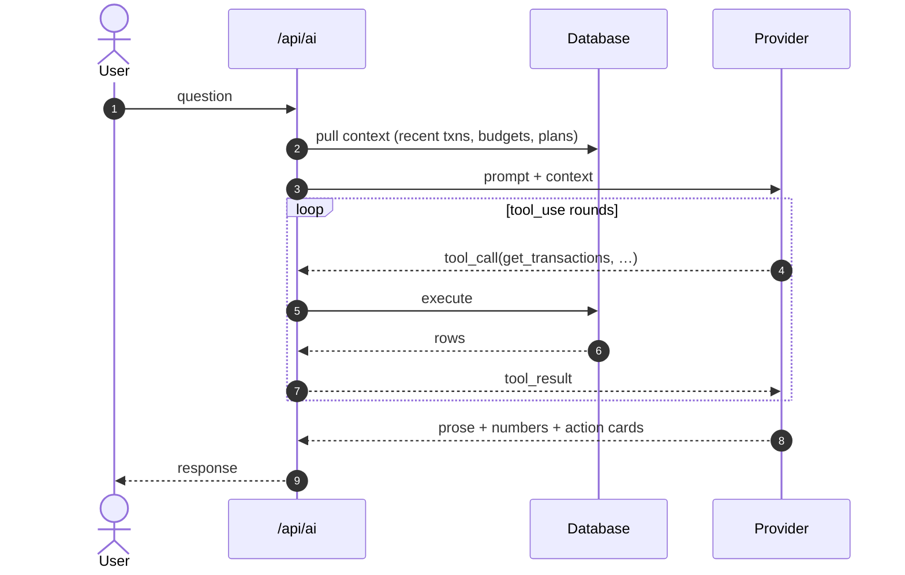
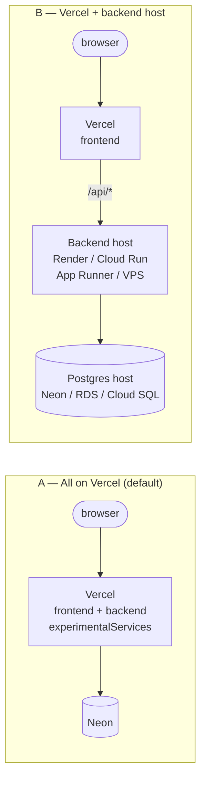

# Architecture

A map of how Aegis is put together. Read this before the design docs in [`design/`](design/) — those cover specific decisions in depth; this covers the system.

For deployment topology specifically, see [`deployment/`](deployment/). For the data model in storage terms, see [`databases.md`](databases.md).

## System overview

Two services (frontend, backend), one database, and an optional Redis. Everything else (Stripe, the LLM provider, Neon) is an external dependency the backend talks to.



The frontend never talks to the backend directly from the browser. Every `/api/*` request goes through Next.js's `rewrites()` proxy in [`frontend/next.config.ts`](../frontend/next.config.ts). That keeps auth same-origin (no CORS preflight), lets the backend URL move without a frontend rebuild, and means there's only ever one env var (`BACKEND_INTERNAL_URL`) to change per environment.

## Backend

FastAPI, layered conventionally: middleware → router → service → ORM → DB.



### Layout

```
backend/app/
├── main.py           lifespan + middleware stack + router registry
├── config.py         pydantic-settings, validates JWT_SECRET_KEY length etc.
├── database.py       sync + async engine factories + get_db dependency
├── auth.py           bcrypt + jose JWT + cookie helpers
├── cache.py          pluggable backend (memory / redis / disabled)
├── jobs.py           arq enqueue helpers
├── worker.py         arq worker entry point
├── middleware/       request-id · rate-limit · body-size · security
├── models/           SQLAlchemy ORM classes (one per entity)
├── schemas/          Pydantic request / response models
├── routers/          one router per resource (transactions, budgets, …)
├── services/         business logic that's reusable across routers
├── seeds/            demo data fixture
└── mcp/              stdio MCP server (Claude Desktop / Code integration)
```

### Why this shape

- **Routers are thin.** Their job is HTTP — request validation, dependency resolution, status codes. Anything reusable lives in `services/`.
- **Services don't know about HTTP.** `notification_service.evaluate_budget_thresholds(db, user_id)` works the same from a router, a worker job, or a test fixture.
- **One model file per entity** keeps imports cheap and circular-dependency risk low.
- **Two engines coexist.** `get_db` returns a sync `Session` (default for every router today). `get_async_db` returns an `AsyncSession` for routes that need it ([`export.py`](../backend/app/routers/export.py) is the worked example). See [`design/002`](design/002-async-sqlalchemy-migration.md) for when to migrate a route.

### Configuration

[`config.py`](../backend/app/config.py) is a `pydantic-settings` `BaseSettings` that reads from env. It **refuses to boot** in production (`DEBUG=false`) if `JWT_SECRET_KEY` is the placeholder or shorter than 32 chars. The full env catalog with defaults lives in [`backend/.env.example`](../backend/.env.example).

## Frontend

Next.js 15 App Router with a strict server / client split.



### State model

- **Server state**: TanStack React Query v5 — `useQuery` for reads, `useMutation` for writes. `staleTime: 60_000` aligns with the backend's 60 s cache TTL so refetch-on-window-focus doesn't slam the API.
- **Client state**: Zustand stores. `auth-store` holds the logged-in user (no JWT in localStorage — auth is cookie-based). `app-store` holds theme + UI preferences. `notification-store` mirrors the bell-icon feed.
- **No JWT in localStorage.** Auth is httpOnly `aegis_session` cookie. The frontend never touches the token directly.

### Routing strategy

Most pages are **client components** today — they fetch the dashboard bundle (or per-entity data) with React Query and render. [`design/003`](design/003-rsc-dashboard-migration.md) covers the RSC migration plan for the dashboard specifically (the only page where the LCP win is worth the cookie-forwarding complexity).

## Data model

The interesting relationships, not every column. Full schema is in [`backend/app/models/`](../backend/app/models/) and migrations are in [`backend/alembic/versions/`](../backend/alembic/versions/).



Two design choices worth flagging:

1. **`category` is a string**, not a foreign key to a `Category` table. Users invent categories ad-hoc on transaction create. Rename = update string. Lower flexibility, much less ceremony.
2. **`tags` are first-class entities** scoped per user — a many-to-many lets one transaction belong to multiple cohorts ("`groceries` + `family-visit`") without overloading category.

Every FK uses `ON DELETE CASCADE` (added in v0.9.6 migration). Deleting a `User` cleans up every owned row in one transaction, no orphans.

## Authentication

Email + password with optional Google ID-token. Session is an httpOnly cookie carrying a 24-hour JWT.

```mermaid
sequenceDiagram
    autonumber
    actor User
    participant FE as Frontend
    participant BE as Backend
    participant DB as Database
    participant GIS as Google Identity Services

    rect rgb(235, 245, 255)
    Note over User,DB: Email + password
    User->>FE: Submit credentials
    FE->>BE: POST /api/auth/login
    BE->>DB: SELECT user; verify bcrypt
    BE-->>FE: Set-Cookie: aegis_session (httpOnly, Secure, SameSite=Lax)
    end

    rect rgb(245, 255, 235)
    Note over User,DB: Google ID-token
    User->>FE: Click "Sign in with Google"
    FE->>GIS: Request ID token
    GIS-->>FE: JWT credential
    FE->>BE: POST /api/auth/google { token }
    BE->>GIS: Verify token signature
    GIS-->>BE: Claims (email, sub)
    BE->>DB: Lookup or auto-link by email
    BE-->>FE: Same Set-Cookie as above
    end

    Note over FE,BE: Every subsequent request:<br/>browser sends aegis_session<br/>backend decodes JWT, resolves user
```

**Auto-link**: if a Google account's `email` matches an existing email/password user, the next Google sign-in attaches `google_subject` to that user. The original password keeps working — both paths are valid.

## Caching

Pluggable backend chosen via `CACHE_BACKEND`. Pattern: read-through with explicit invalidation on writes. Details in [`tutorials/11-caching.md`](tutorials/11-caching.md).



Cached today: `/api/dashboard/{summary,charts,health-score,cashflow-forecast,bundle}` + `/api/ai/{weekly-summary,insights}`. 60 s TTL. Every transaction mutation calls `invalidate_user_all(user_id)` which drops every dashboard scope for that user.

## Rate limiting

Fixed-window-per-IP middleware. Redis-backed when `CACHE_BACKEND=redis`, falls back to per-process in-memory otherwise (loses cross-worker accuracy but doesn't fail open). Strict-prefix list (`/api/auth/{login,register,google,logout}`, `/api/export/`) gets its own tighter limits to slow brute-force.

## Background jobs

Long-running work (PDF generation, AI batch summaries) is queued onto `arq` + Redis. The worker is a separate process. Job lifecycle:



Backward-compat: when `CACHE_REDIS_URL` isn't set, `?background=true` falls back to inline rendering on the request thread. That keeps a single-pod dev / Vercel-Hobby deploy functional (within timeout limits). Design in [`design/001`](design/001-background-worker-queue.md).

## AI integration

Three providers swap behind one env var (`AI_PROVIDER=anthropic|typhoon|groq`). The frontend never talks to the LLM — it talks to `/api/ai/*`, which composes a user-scoped context window + the question and sends it to the configured provider. Claude in particular uses `tool_use` so the model can ask for more data (`get_transactions`, `get_budget_status`) inside one turn.



Tutorial-level coverage: [`tutorials/03-using-the-ai-assistant.md`](tutorials/03-using-the-ai-assistant.md).

## Deployment topology

Aegis supports five recipes (see [`deployment/`](deployment/)) but they collapse into two shapes:



Choice driver: do you need PDF export, the background worker queue, or AI calls > 10 s on a free tier? If no → A. If yes → B. Comparison table in [`deployment/vercel.md`](deployment/vercel.md).

## Observability

- **Logs**: `loguru` everywhere. `LOG_FORMAT=json` in prod for CloudWatch / Cloud Logging / Logtail. `/api/health` probe traffic is suppressed from access logs (otherwise it dominates).
- **Health check**: `GET /api/health` runs `SELECT 1` against the DB. A 200 means the app can actually serve traffic, not just that the process is alive.
- **Request ID**: `RequestIDMiddleware` adds `X-Request-ID` to every response. Pair it with `loguru`'s bound context to correlate logs across the request lifecycle.
- **Tracking**: Sentry isn't wired in yet. Until then, alert on `level=ERROR` log lines.

## Cross-cutting design choices

A few decisions worth understanding before contributing:

1. **JWT in httpOnly cookie, not localStorage.** Eliminates an entire class of XSS-driven token theft. Cost: CSRF surface needs handling (we use SameSite=Lax + same-origin via Vercel rewrites).
2. **One Pydantic model per response shape, not generic dicts.** Every cached scope's JSON has a schema — when the schema changes, the deploy can flush cache and rebuild. See `tutorials/11-caching.md` § "Cached values broke after a deploy".
3. **Service layer doesn't import FastAPI.** That's what lets a service module run inside the `arq` worker, a CLI command, or a test fixture without dragging in HTTP machinery.
4. **No ORM relationship lazy-loading in async paths.** Async routes must `selectinload()` upfront — touching an unloaded relationship inside async raises `MissingGreenlet`. Sync routes can be lazy. See [`design/002`](design/002-async-sqlalchemy-migration.md).
5. **Cache is an optimization, never a correctness layer.** Every cached read has a TTL ≤ 60 s and an invalidation hook on related writes. If Redis vanishes, the app degrades to "every read hits the DB" — no 500s.

## Where to look next

| Question | File |
|----------|------|
| How do I deploy this? | [`deployment/README.md`](deployment/README.md) |
| Which database should I use? | [`databases.md`](databases.md) |
| How does the cache work? | [`tutorials/11-caching.md`](tutorials/11-caching.md) |
| Why is the worker queue shaped this way? | [`design/001-background-worker-queue.md`](design/001-background-worker-queue.md) |
| When should I convert a route to async SQLAlchemy? | [`design/002-async-sqlalchemy-migration.md`](design/002-async-sqlalchemy-migration.md) |
| Is RSC worth migrating the dashboard to? | [`design/003-rsc-dashboard-migration.md`](design/003-rsc-dashboard-migration.md) |
| What performance work is still on the backlog? | [`PERFORMANCE_BACKLOG.md`](PERFORMANCE_BACKLOG.md) |
| How do I run analytics on top of this data? | [`analytics-warehouses.md`](analytics-warehouses.md) |
