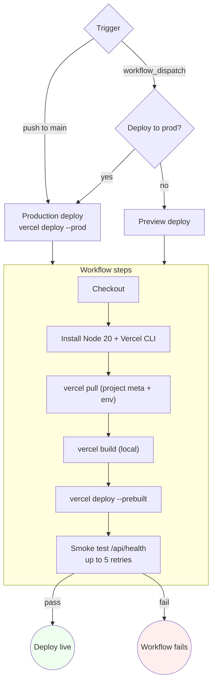

# Vercel deploy — workflow walkthrough

Step-by-step setup for shipping the Aegis frontend to Vercel, with a GitHub Actions workflow that handles preview + production deploys, runs a post-deploy smoke test, and stays out of your way when the build is green.

This doc covers **frontend only**. For the backend, see [`vercel-neon.md`](vercel-neon.md) (Render), [`aws.md`](aws.md), [`gcp.md`](gcp.md), or [`self-hosted.md`](self-hosted.md).

## Workflow overview



## Two ways to deploy

| Option | When |
|---|---|
| **A. Vercel native GitHub integration** | Recommended for first deploys. Zero workflow code; Vercel auto-creates a preview on every PR + a production deploy on every push to `main`. Configured entirely in the Vercel dashboard. |
| **B. GitHub Actions workflow** (this repo's `.github/workflows/deploy-vercel.yml`) | When you want CI to gate the deploy, run a custom smoke test, scope secrets via GitHub Environments, or coordinate frontend + backend deploys in one place. |

You can use both. Vercel skips the native deploy when a commit was pushed by the GHA token, so they coexist cleanly.

## Option A — Native integration (zero workflow code)

1. **Vercel dashboard → Add New → Project → Import Git Repository**. Pick your Aegis fork.
2. **Root Directory**: click **Edit** and select `frontend`. Vercel auto-detects Next.js.
3. **Environment Variables** — paste in for all three scopes (Production / Preview / Development):
   - `BACKEND_INTERNAL_URL` — public URL of your backend (e.g. `https://aegis-backend.onrender.com`). Vercel's rewrite proxy uses this server-side.
   - `NEXT_PUBLIC_GOOGLE_CLIENT_ID` — optional; only if you want the Google sign-in button. **Must be set at build time** (Next.js inlines `NEXT_PUBLIC_*` into the static bundle), so setting it after the first build needs a redeploy.
4. **Deploy**. First build ~2 min.
5. Once the first deploy is live, every push to `main` auto-deploys to production, and every PR gets its own preview URL.

That's it. The rest of this doc is Option B.

## Option B — GitHub Actions workflow

Use this when:
- You want CI to gate the deploy (lint, type-check, tests must pass first).
- You want a post-deploy smoke test that fails the workflow if the new build is broken.
- You want approval gates on production via GitHub Environments.
- You're running multiple deploys in one workflow and want them coordinated.

### What the workflow does

[`.github/workflows/deploy-vercel.yml`](../../.github/workflows/deploy-vercel.yml) — triggers:

| Trigger | Behavior |
|---|---|
| Push to `main` | Production deploy via `vercel deploy --prod` |
| Manual `workflow_dispatch` | Preview deploy by default; check the "Deploy to production" box to push to prod |

Steps:

1. **Checkout** the commit.
2. **Install** Node 20 + the Vercel CLI globally.
3. **Pull** the Vercel project's metadata + env vars (`vercel pull`). Picks the production or preview environment based on trigger.
4. **Build** locally with `vercel build` (telemetry disabled). Same builder Vercel runs on its own infrastructure, so behavior is identical to a native deploy.
5. **Deploy** the prebuilt output with `vercel deploy --prebuilt`. Fast — uploads only the build artifacts, not the source.
6. **Smoke test** — hits `/api/health` on the deployed URL up to 5 times, expecting `"status":"ok"`. Fails the workflow if the frontend is up but the backend isn't reachable through the rewrite. Catches misconfigured `BACKEND_INTERNAL_URL` before users do.

Concurrency control: same-branch pushes cancel the previous in-flight deploy so you don't end up with two parallel Vercel builds racing each other.

### One-time setup

**1. Link the project locally (one-time, per-machine)**

```sh
cd frontend
npx vercel link
```

This walks you through "what Vercel project do you want this to map to?" and writes `frontend/.vercel/project.json`. Two values inside that file matter:

```json
{
  "projectId": "prj_abcdef123...",
  "orgId": "team_xyz789..."
}
```

`.vercel/` is `.gitignore`'d — these IDs live in GitHub secrets.

**2. Generate a Vercel deploy token**

[`vercel.com/account/tokens`](https://vercel.com/account/tokens) → **Create**. Scope: full account (the CLI doesn't support narrower scopes). Set an expiration if you like; rotate manually otherwise.

**3. Add three repository secrets**

GitHub → repo → **Settings → Secrets and variables → Actions → New repository secret**:

| Secret | Value |
|---|---|
| `VERCEL_TOKEN` | The token from step 2 |
| `VERCEL_ORG_ID` | `orgId` from `frontend/.vercel/project.json` |
| `VERCEL_PROJECT_ID` | `projectId` from the same file |

**4. (Optional) Configure GitHub Environments for approval gates**

Repo → **Settings → Environments → New environment** → name it `production`. Add:
- **Required reviewers**: yourself + anyone else who must approve a prod deploy.
- **Deployment branches**: `main` only.

If `production` environment doesn't exist, the workflow falls back to repo-level secrets. With the environment, you get an explicit approval step before the deploy runs.

**5. Push to `main`**

The workflow runs. First execution should land in ~2 minutes for a clean Next.js build.

### Triggering a preview deploy manually

GitHub → **Actions → deploy-vercel → Run workflow**. Leave "Deploy to production" unchecked. The workflow deploys to a preview URL on any branch.

Useful for QA testing a feature branch without touching `main`.

## Env-var matrix

| Var | Where it lives | Required? | Notes |
|---|---|---|---|
| `BACKEND_INTERNAL_URL` | Vercel env panel | **Yes** | Public URL of the backend (`https://aegis-backend.onrender.com`). Used by `frontend/next.config.ts` server-side rewrite. |
| `NEXT_PUBLIC_GOOGLE_CLIENT_ID` | Vercel env panel | Optional | Same value as backend `GOOGLE_OAUTH_CLIENT_ID`. Build-time only — set BEFORE the first build. |
| `NEXT_PUBLIC_API_URL` | Vercel env panel | Optional | Override only if you want the browser to hit the backend directly (e.g. for SSE streaming). Default empty → use the rewrite proxy. |
| `VERCEL_TOKEN` | GitHub secret | If using GHA | Deploy token. |
| `VERCEL_ORG_ID` | GitHub secret | If using GHA | From `vercel link`. |
| `VERCEL_PROJECT_ID` | GitHub secret | If using GHA | From `vercel link`. |

## Common failure modes

**"Project not found" from `vercel pull`**

`VERCEL_PROJECT_ID` doesn't match a project on the org tied to `VERCEL_TOKEN`. Re-run `vercel link` locally and update both secrets together.

**Smoke test fails with "Backend not reachable through the rewrite"**

Frontend is up but `/api/health` isn't proxying. Three likely causes:
1. `BACKEND_INTERNAL_URL` in Vercel env is wrong or missing.
2. Backend (Render / Fly / etc.) is down. Hit `<backend>/api/health` directly to verify.
3. Backend is up but its first request after wake takes longer than the smoke test's 5 × 10 s budget. Common on Neon free tier (cold-suspend). Bump the retry loop in the workflow if it's a real concern.

**Build succeeds locally but fails in CI**

Most often a missing env var. `vercel pull` populates `frontend/.vercel/.env.production.local` from the dashboard; verify the Vercel project has every var the build needs (especially `NEXT_PUBLIC_*` ones).

**Deploy succeeds but `/api/auth/me` returns 401**

The cookie isn't being sent. Most likely cause: `CORS_ORIGINS` on the backend doesn't include the new Vercel URL. Or your custom domain wasn't added to Vercel + backend `FRONTEND_URL`. Hit `/api/auth/login` from devtools network panel and check the `Set-Cookie` response header.

## Rolling back

**Vercel-native**: Vercel dashboard → **Deployments** → click an older successful deploy → **Promote to Production**. Instant.

**Through the workflow**: revert the commit on `main`. The workflow runs again on the revert push, deploys the previous code.

## Cost

| Tier | Limit | Use case |
|---|---|---|
| **Hobby** ($0) | 100 GB bandwidth/mo, 1000 build-minutes/mo, 6000 serverless function invocations/day | Small launches |
| **Pro** ($20/user/mo) | 1 TB bandwidth, unlimited build minutes, 1M function invocations | Most production |
| **Enterprise** | Custom | High-traffic |

Aegis is a static-export Next.js app with server-side rewrites — minimal serverless function usage. Hobby tier covers the first ~10k users comfortably.

## What this workflow doesn't do

- **No frontend tests** — the `test.yml` workflow handles those. This deploy workflow assumes the test gate already passed. To enforce that, add `needs: [test]` to the deploy job and rename `test.yml`'s frontend job.
- **No backend deploy** — that's separately wired (Render auto-deploys on push, or use the cloud-specific workflows in `docs/deployment/`).
- **No DB migration step** — backend's `docker-entrypoint.sh` runs `alembic upgrade head` on container start. Vercel never touches the DB.

## Related docs

- [`vercel-neon.md`](vercel-neon.md) — full Vercel + Neon + Render runbook including the **UAT acceptance checklist**.
- [`aws.md`](aws.md) — AWS App Runner / ECS Fargate alternative for the backend.
- [`gcp.md`](gcp.md) — GCP Cloud Run alternative for the backend.
- [`../tutorials/06-deploy-production.md`](../tutorials/06-deploy-production.md) — deploy-day runbook with prerequisites, secrets, first-boot health checks.
