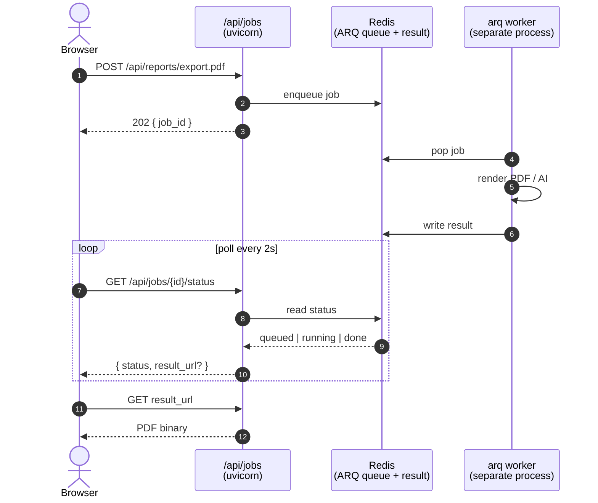
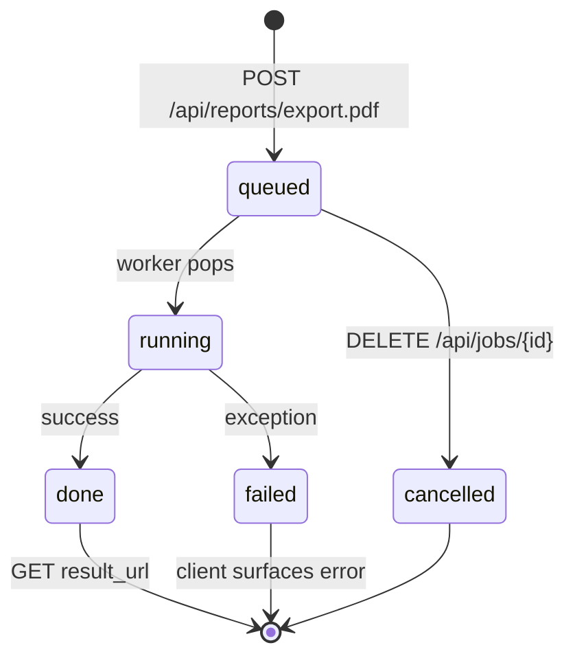

# Design: background worker queue for PDF + AI calls

**Status**: design draft. Not implemented. Review before kicking off.

**Context**: WeasyPrint PDF generation (~800 ms CPU per request) and AI provider calls (up to 30 s wall time) currently run inline on the uvicorn worker that received the HTTP request. With `--workers 4` this means a single concurrent PDF + AI request burns half the workers for the duration. If a third user lands during that window they get queued; if all four workers are busy a fifth user's `/api/health` probe fails.

The right shape: enqueue heavy work onto a background worker pool, return a job ID immediately, and let the frontend poll (or use SSE) for completion.

## Options considered

| Option | Pros | Cons | Verdict |
|---|---|---|---|
| **Celery + Redis** | Industry standard, mature, full feature set | 2 extra processes (worker + beat), eventlet/gevent compatibility quirks, ~50MB extra image | Mainstream choice — pick if you want feature completeness |
| **arq** (async-first, Redis-backed) | Native asyncio, simpler than Celery, single binary | Smaller ecosystem, less battle-tested | **RECOMMENDED** — modern, lightweight, matches our async future direction |
| **rq** (Redis Queue) | Simpler than Celery, sync workers | No async, less feature-rich than Celery | Pick if you actively want sync simplicity |
| **FastAPI `BackgroundTasks`** | Already built-in, zero deps | In-process — doesn't survive worker restart, no cross-pod visibility | **No** — fails the "robust" requirement |
| **Cloud-native** (Render cron / Cloud Tasks / SQS) | No long-running process to manage | Vendor-specific, harder local dev | Pick if you're committed to one cloud |

Going with **arq** below. Reasons: matches the codebase's existing Redis dep (already used for cache + rate limit), async-native so it composes with the eventual async-SQLAlchemy migration, and the API is small enough that swapping it out later is cheap.

## Architecture



## API surface



```http
POST /api/reports/export.pdf
  → { "job_id": "abc123", "status": "queued" }   # 202 Accepted

GET /api/jobs/abc123/status
  → { "status": "running" | "done" | "failed", "result_url"?: "..." }

# Optional: SSE channel for push-based completion
GET /api/jobs/abc123/events  (text/event-stream)
```

The frontend's `exportPDF()` becomes:
1. POST `/api/reports/export.pdf` → get job_id
2. Poll `/api/jobs/{job_id}/status` every 2 s
3. On `done`, redirect to `result_url` for the actual PDF download

UX: show a progress indicator with a "Cancel" button.

## What moves to the worker

Initial scope (Phase 1):
1. **PDF generation** (`/api/reports/export.pdf`) — biggest CPU win
2. **AI weekly summary** (`/api/ai/weekly-summary` when uncached)
3. **AI insights** (`/api/ai/insights` when uncached)

Stays inline (Phase 2 candidates):
- AI `/recommend` and `/forecast` — interactive, user is waiting; not a fit for queue
- CSV import — fast enough now post-pandas-removal
- NDJSON exports — already streamed, no CPU spike

## Implementation plan

```
1. Add arq dep: `arq>=0.26`
2. Create backend/app/worker.py with the worker entrypoint + task registry
3. Convert pdf_renderer.render_to_pdf() → @arq task
4. New routes:
   - POST /api/jobs/enqueue (internal helper, not exposed)
   - GET  /api/jobs/{job_id}/status
   - DELETE /api/jobs/{job_id}  (cancel — best-effort)
5. Refactor existing /api/reports/export.pdf to enqueue + return 202
6. Frontend: replace direct download with poll-then-download
7. Docker: docker-compose adds an `aegis-worker` service running
   `arq app.worker.WorkerSettings`
8. Render deploy: separate Background Worker service ($7/mo) running
   the same image with `arq app.worker.WorkerSettings` as the command
9. Tests: mock the Redis queue, assert enqueue + poll cycle
10. Docs: update vercel-neon.md + tutorials with the new flow
```

Estimated effort: **half day** for Phase 1 if everything goes smoothly. Plus another half-day for polish + tests + docs.

## Risks

- **Worker crash**: if the worker dies mid-job, arq retries up to N times. Need to make WeasyPrint rendering idempotent (it already is — pure function of inputs).
- **Result storage**: where does the generated PDF live? Options:
  - In Redis (bounded TTL, simple, costs RAM)
  - On disk (worker-local, lost on restart, needs cleanup)
  - In S3/R2 (durable, costs $$, adds dep)
  - **Recommended**: Redis with 1-hour TTL — generated PDFs are throwaway artifacts; if user wants it later, they re-generate.
- **Memory pressure**: arq worker holds matplotlib + WeasyPrint in memory. Same shape as today's API workers; need to size the worker dyno to match.
- **Frontend complexity**: poll loop + cancel handling adds UI surface area. AbortController on unmount.

## What this design does NOT cover

- Scheduled tasks (cron). Different problem (no user waiting); use Render's native cron or arq's cron extension.
- Long-running streaming jobs (real-time AI). Different shape; use SSE direct from the API worker, not a queue.
- Multi-tenant fairness. If user A enqueues 100 PDFs they'd block user B's first PDF for ~80 s. Phase 3: per-user queue with priority.

## Open questions for the user

1. Result storage — Redis (cheap, ephemeral) or S3 (durable, more setup)?
2. Phase 1 scope — PDF only, or PDF + AI summary at the same time?
3. Render plan — willing to add a $7/mo Background Worker service, or want to defer until traffic justifies it?

Once these are answered, the implementation is ~half-day from this design.
