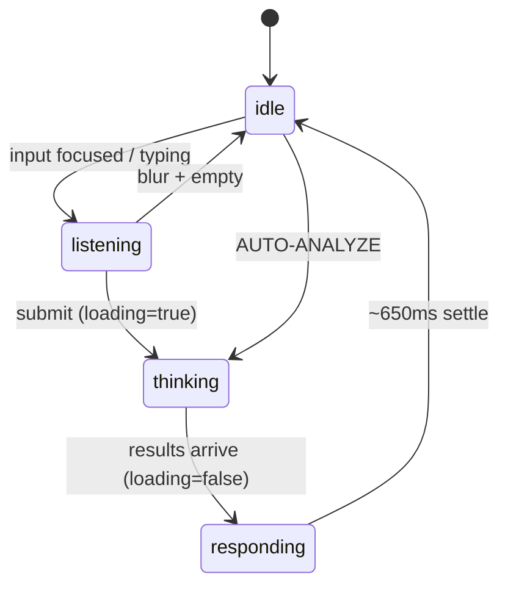
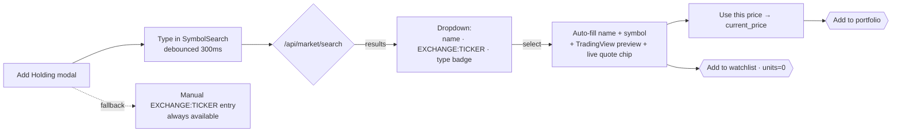
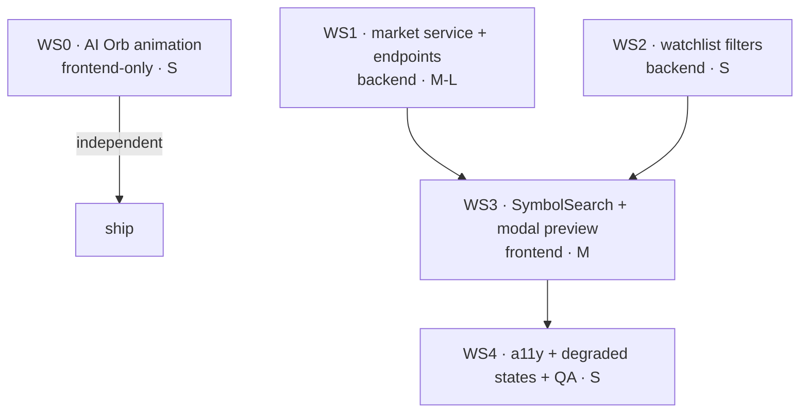

# Design: AI "asking" animation + interactive stock/crypto picker

**Status**: ✅ implemented. This doc began as a design/research pass; both features have since shipped on this branch with the decisions resolved as **Finnhub + graceful manual fallback** (live market data, optional key), the **framer-motion Transmission Orb** (no new deps), and the **`units = 0` watchlist** (no migration). The original options/rationale are preserved below; see `CHANGELOG.md` (`[Unreleased]`) for the shipped summary.

This covers two requested additions:

- **A — AI asking animation**: a richer, on-brand animated AI presence when you ask the advisor a question, replacing today's three bouncing dots.
- **B — Interactive investments**: let you *search and pick* a stock or cryptocurrency and interact with it (preview, add to portfolio / watchlist) instead of hand-typing TradingView ticker strings.

Both are deliberately additive — they extend code that already exists rather than replacing it.

---

## What already exists (today)

It's worth being precise, because both features are ~60% built already.

**AI advisor** — `frontend/src/components/ai/ai-panel.tsx` is a framer-motion slide-in panel with a `CLAUDE · live` badge, an `aiAPI.analyze()` request/response call (no streaming), a recommendations list with accept/dismiss, and a magenta prompt input. The only "thinking" affordance is three bouncing dots + the text `ANALYZING TRANSMISSION…` (≈ lines 139–167). There is no distinct *listening* or *responding* state — just a binary `loading`.

**Investments** — already a real feature, not a stub:

- `backend/app/models/investment.py` — `Investment` (name, `tradingview_symbol`, units, cost_basis, `current_price` *manually edited*, currency, notes, `last_priced_at`).
- `backend/app/routers/investments.py` — full CRUD + `GET /summary` portfolio rollup.
- `frontend/src/app/investments/page.tsx` — portfolio summary cards, a holdings grid with live **TradingView** charts, and an Add/Edit modal.
- `frontend/src/components/investments/tradingview-widget.tsx` — lazy, IntersectionObserver-gated TradingView Symbol Overview embed keyed by `EXCHANGE:TICKER`.

The two friction points the picker removes: the user must **hand-type** a fragile `EXCHANGE:TICKER` string (regex-gated, e.g. `NASDAQ:AAPL`, `BINANCE:BTCUSDT`) **and** type a **manual price**. The backend today deliberately ships **no third-party market-data feed** (manual mark-to-market) — so adding live search/prices is a real architectural decision, not a freebie. `ROADMAP.md` already lists "Investment portfolio … with price feeds" under post-v1 expansion, so this is on-roadmap.

---

## Feature A — the AI "asking" animation

### Concept: the Transmission Orb

A small (~28 px) CSS-variable-driven gradient sphere — a magenta-core plasma point wrapped in a faint glow halo with two orbiting "satellite" sparks — that lives in the panel header beside the `CLAUDE · live` badge and re-appears (larger) as the in-flight affordance. It reads as the literal source of the transmission: calm and breathing at idle, leaning in while you type, spinning its satellites while it thinks, then exhaling a bloom as insights land. The same plasma is echoed as a shimmer sweep across skeleton cards while results arrive.

Built entirely with **framer-motion** (already a dependency) + CSS — **zero added bundle**, no Lottie/Rive. (See the research appendix for why: Lottie is ~60 KB and hostile to CSS-variable recoloring; Rive adds a ~78 KB WASM load. framer-motion is already in the tree and themes trivially off CSS variables.)

### State machine



| State | Trigger | Visual | Motion |
|-------|---------|--------|--------|
| **idle** | panel open, no focus, nothing in flight | dim core (~60%), faint halo, satellites parked | slow breathe, scale 1→1.04, ~3.2 s loop |
| **listening** | input focused **or** `question.length > 0` | core brightens to full primary, halo widens | quick lean-in (spring to 1.08); satellites begin slow 8 s orbit |
| **thinking** | `loading === true` | core saturated, glow pulses | satellites orbit fast (1.4 s), core pulse-glow — replaces the bouncing dots |
| **responding** | `loading` falls with `recommendations.length > 0` | one glow **bloom**, then settles to idle | bloom scale 1.18 → ease back; cards stagger in via existing `staggerItem` |

### Component design

New `frontend/src/components/ai/ai-orb.tsx` — a pure presentational component driven by one `state` prop:

```tsx
export type OrbState = "idle" | "listening" | "thinking" | "responding";

const orbVariants: Variants = {
  idle:       { scale: [1, 1.04, 1], transition: { duration: 3.2, repeat: Infinity, ease: "easeInOut" } },
  listening:  { scale: 1.08,         transition: { type: "spring", stiffness: 320, damping: 18 } },
  thinking:   { scale: [1, 1.06, 1], transition: { duration: 1.1, repeat: Infinity, ease: "easeInOut" } },
  responding: { scale: [1.18, 1],    transition: { duration: 0.6, ease: [0.16, 1, 0.3, 1] } },
};

export function AIOrb({ state, size = 28 }: { state: OrbState; size?: number }) {
  const reduce = useReducedMotion();
  return (
    <motion.span className="aegis-orb" data-state={state} aria-hidden
      style={{ width: size, height: size }}
      variants={reduce ? undefined : orbVariants} animate={state}>
      <span className="aegis-orb-core" />
      <span className="aegis-orb-halo" />
      {!reduce && <span className="aegis-orb-sat" />}
    </motion.span>
  );
}
```

`ai-panel.tsx` derives the state from props it already has (plus a focus flag and a short-lived "just resolved" flag set in `handleAnalyze`'s `finally`):

```tsx
const orbState: OrbState =
  loading                       ? "thinking"
  : justResolved                ? "responding"
  : (focused || question.length) ? "listening"
  : "idle";
```

### CSS additions (`globals.css`)

A gradient core, glow halo, an orbiting spark, and a shimmer skeleton — all off existing theme tokens:

```css
.aegis-orb { position: relative; display: inline-grid; place-items: center; }
.aegis-orb-core {
  width: 56%; height: 56%; border-radius: 50%;
  background: radial-gradient(circle at 35% 30%,
    color-mix(in oklab, var(--primary) 95%, white), var(--primary) 55%, var(--accent-2, var(--primary)) 100%);
  filter: drop-shadow(0 0 6px var(--accent-glow, var(--primary)));
}
.aegis-orb[data-state="idle"] .aegis-orb-core { opacity: .62; }
.aegis-orb[data-state="thinking"] .aegis-orb-core { animation: pulse-glow 1.4s ease-in-out infinite; }
.aegis-orb-sat { position: absolute; inset: 0; border-radius: 50%;
  box-shadow: 0 -11px 0 -3px var(--primary); animation: orbSpin 8s linear infinite; }
.aegis-orb[data-state="thinking"] .aegis-orb-sat { animation-duration: 1.4s; }
@keyframes orbSpin { to { transform: rotate(360deg); } }

.aegis-shimmer { height: 64px; border-radius: var(--card-radius, 12px);
  background: linear-gradient(100deg, var(--card) 30%,
    color-mix(in oklab, var(--primary) 14%, var(--card)) 50%, var(--card) 70%);
  background-size: 200% 100%; animation: orbShimmer 1.3s linear infinite; }
@keyframes orbShimmer { to { background-position: -200% 0; } }

@media (prefers-reduced-motion: reduce) {
  .aegis-orb-sat, .aegis-orb-core, .aegis-shimmer { animation: none !important; }
}
```

> **Token note**: `ai-panel.tsx` reads `--primary` / `--aegis-*`, while `globals.css` defines the cosmic palette as `--accent` / `--accent-glow` / `--pane-2` / `pulse-glow`. They appear to alias each other; the implementer should confirm the exact names in `globals.css` and use whichever the theme actually exposes. The fallbacks above (`var(--x, var(--primary))`) degrade safely either way.

### Integration points in `ai-panel.tsx`

- **Header badge** (≈ lines 75–81): mount `<AIOrb state={orbState} />` just before the `CLAUDE · live` text inside `.aegis-ai-badge`. The orb augments the badge; the existing pulse dot can stay or be removed.
- **Loading block** (≈ lines 139–167): replace the three bouncing-dot spans with a centered `<AIOrb state="thinking" size={40} />` above `ANALYZING TRANSMISSION…`, and render three `.aegis-shimmer` rows below so the list height is reserved (no layout shift when cards swap in).
- **Input row** (≈ lines 245–251): add `onFocus`/`onBlur` to drive `focused`.
- **Resolve bloom**: in `handleAnalyze`'s `finally`, set `justResolved=true` then clear it after ~650 ms.

### Accessibility & performance

- **Reduced motion**: `useReducedMotion()` drops the looping variants (static brightened core via `data-state` color only); the CSS `@media` query kills `orbSpin`/`pulse-glow`/shimmer. Wrap the panel in `<MotionConfig reducedMotion="user">` so card entrances also respect it.
- **Screen readers**: the orb is `aria-hidden`; status is conveyed textually — give the `ANALYZING TRANSMISSION…` line `aria-live="polite"`, plus an SR-only "N recommendations ready" on resolve.
- **Performance**: animate only `transform` / `opacity` / `background-position` (GPU-compositable); skeletons pre-reserve list height → **zero layout shift**; ~0 added bytes, no new deps.

---

## Feature B — the interactive stock & crypto picker

### UX flow



1. Open **Add Holding** → focus the search → type "apple".
2. A **300 ms-debounced** query hits `marketAPI.search("apple")`; the dropdown shows up to 10 rows: **name · `EXCHANGE:TICKER`** (mono) **· exchange · type badge** (Stock / ETF / Crypto).
3. Selecting a row **auto-fills** `name` + `tradingview_symbol`, and shows a **preview**: the existing `TradingViewWidget` (keyed by the picked symbol) + an optional **live quote chip** (price + day change).
4. **"Use this price"** copies the quote into `current_price` (still editable). User fills `units` / `cost_basis`.
5. Footer offers **Add to portfolio** (current flow) and **Add to watchlist** (a `units=0` holding — see below). Manual `EXCHANGE:TICKER` entry stays available as a fallback and is the only equities path when no API key is configured.

### Data-source research (free tiers, 2026)

The constraint that makes this tractable: the app already renders TradingView widgets keyed by `EXCHANGE:TICKER`, so the picker only needs a provider whose results **map cleanly to that format**.

| Provider | Free limit | Key / CC | Coverage | Maps to `EXCHANGE:TICKER`? |
|----------|-----------|----------|----------|----------------------------|
| **Finnhub** `/search` | 60/min | key, no CC | US equities + crypto | **Best** — crypto is already `BINANCE:BTCUSDT`; equities need a small `XNAS→NASDAQ` MIC map |
| **Twelve Data** `/symbol_search` | ~8/min, 800/day | key, no CC | stocks, FX, crypto | Good — returns exchange/MIC; also serves quotes + candles |
| **Financial Modeling Prep** | 250/day | key, no CC | broad | Fairly direct (`exchangeShortName`) |
| **Binance** `/exchangeInfo` | keyless, high | **none** | **crypto only** | Native — `BTCUSDT` → prefix `BINANCE:` |
| Alpha Vantage | 25/day | key | weak crypto search | Poor — avoid for typeahead |
| TradingView `symbol_search` | undocumented | none | both, native | **403 without faked headers, ToS-gray — avoid in prod** |

**Recommendation**: **Finnhub** as primary symbol search (60/min comfortably covers debounced typeahead; crypto arrives pre-formatted), with **Binance public REST** as the **zero-key fallback** (crypto-only, browser/CORS-friendly, native mapping). For an optional live price: Twelve Data `/quote` (equities) + Binance `/ticker/price` (crypto); render any sparkline via the **existing TradingView mini-widget** to spend **zero** API quota. There is **no keyless equities option** in 2026 — so without a key the picker degrades to crypto-only search + manual entry for stocks.

**ToS gotchas**: Finnhub / Twelve Data / FMP free tiers are display-only, non-commercial, no redistribution. Binance data may be displayed but not re-served as your own feed. Keys must stay server-side.

### Backend design

A new market-data service mirroring the existing `ai_engine` lazy-client pattern (`httpx>=0.27` is already a dependency):

```
backend/app/services/market/
  base.py        # MarketProvider ABC: search(q) -> list[SymbolResult]; quote(symbol) -> Quote | None
  finnhub.py     # primary (if FINNHUB_API_KEY set) + MIC_TO_EXCHANGE map
  binance.py     # keyless crypto fallback
  __init__.py    # get_market_service(): finnhub if key else binance-only else degraded
```

New router `backend/app/routers/market.py` (prefix `/api/market`, behind `get_current_user`):

```
GET /api/market/search?q=...               -> SymbolSearchResponse   # q ≥ 2 chars
GET /api/market/quote?symbol=EXCHANGE:TICKER -> QuoteResponse          # null fields if unavailable
GET /api/market/status                     -> { equities_supported, crypto_supported, providers }
```

Pydantic schemas (`schemas/market.py`): `SymbolResult { symbol, name, exchange, type: stock|etf|crypto, currency? }`, `SymbolSearchResponse { results, provider, degraded }`, `QuoteResponse { symbol, price?, currency?, change_percent?, as_of?, source? }`.

- **Mapping** lives in one auditable module-level `MIC_TO_EXCHANGE` dict; unknown MICs are dropped so we never emit an un-chartable symbol.
- **Caching** (reuse `backend/app/cache.py`): `market:search:<q_norm>` TTL ~600 s, `market:quote:<symbol>` TTL ~30 s. These are **global, not user-scoped** (do *not* register them in the user-scope list). Normalize `q` (lowercase/trim) before hashing.
- **Rate limits**: catch provider `429` → serve last cached value if present, else `503 {detail: "rate_limited"}`. The existing `RateLimitMiddleware` already throttles per-IP.
- **Config** (`config.py`): `finnhub_api_key = ""`, `twelvedata_api_key = ""`, `market_search_ttl = 600`, `market_quote_ttl = 30`. **No key** → crypto-only Binance results with `degraded: true`; `/status` reports `equities_supported: false`. Log `market="finnhub"|"binance-only"|"disabled"` in `lifespan`.

### Watchlist: reuse `Investment` with `units = 0` (recommended)

A watchlist item is just an `Investment` with `units = 0` and `cost_basis = 0`.

- **No new table, no migration.** The model, CRUD, and TradingView card all work unchanged; `units` already defaults to 0.
- The only fix: `GET /summary` currently counts every row — add a one-line `Investment.units > 0` filter so watchlist rows contribute $0 (already correct via `units * price`) **and** don't inflate `holding_count`. Add a `?watchlist=true|false` filter to `list_investments`.
- "Promote watchlist → holding" becomes simply setting `units`.
- Justification vs. a `is_watchlist` boolean or a separate table: **zero migration risk** and full reuse of the existing add/edit/chart surface. If product later needs price targets or alerts on watchlist items, revisit with an explicit boolean (one-line `batch_alter_table` migration, matching the SQLite-safe pattern in `e5a3b7c20d11`).

### Frontend design

- **`marketAPI`** added to `frontend/src/lib/api.ts` (same `fetchJSON` pipeline as `investmentsAPI`): `search(q)`, `quote(symbol)`, `status()`.
- **`components/investments/symbol-search.tsx`** — a debounced typeahead **reusing the `components/search/command-palette.tsx` combobox pattern** (no new shadcn `command` dep): controlled input → 300 ms debounce → `useQuery` gated on `q.trim().length >= 2`, `staleTime: 600_000` to match server TTL, `placeholderData: keepPreviousData` to avoid flicker. Keyboard a11y: `role="listbox"`, `aria-activedescendant`, ↑/↓/Enter/Esc, `aria-expanded`. States: loading spinner, `No matches`, `Search unavailable — enter ticker manually`, and a `degraded` banner (`Crypto only — no market-data key configured`).
- **Modal integration** (`app/investments/page.tsx`, modal ≈ lines 331–415): replace the `tradingview_symbol` `Input` with `<SymbolSearch onSelect=…>`; render the preview once a symbol exists; keep the existing regex `Input` behind a **"Enter ticker manually"** toggle so validation + the no-key path are preserved. Two submit buttons reuse `createMutation` (watchlist sends `units: 0`).

### Schema / migration deltas

**None to the model for the picker or the watchlist** (watchlist = `units = 0`). Changes are router-level only: the `?watchlist` filter and the `units > 0` rollup filter in `/summary`. No new Alembic revision unless product later opts into an explicit `is_watchlist` column.

---

## Open product decisions (need your call)

These gate the implementation phase:

1. **Live market data vs. stay manual** — *the big fork.* Introduce **Finnhub** (free key, you'd sign up once) so equities + crypto search and optional live prices work? Or keep the deliberate "no data feed" stance and ship **crypto-only** search via keyless Binance, with stocks still entered manually? My recommendation: **add Finnhub as an optional key** — the design degrades gracefully to crypto-only + manual when the key is absent, so we get the best of both and you can defer signing up.
2. **Animation scope** — ship the framer-motion **Transmission Orb** as specced (recommended, zero new deps), or do you want a bolder direction later (e.g. a Rive-authored mascot, ~78 KB WASM)?
3. **Watchlist depth** — `units = 0` reuse (recommended, no migration) is enough for v1; a dedicated entity is only worth it if you want price targets/alerts soon.

## Sequencing & effort



- **WS0 (AI orb)** is fully independent of B and can ship first — pure frontend, no backend, no product decision blocking it.
- **WS1/WS2** (backend) unblock **WS3** (frontend picker); **WS4** is the polish/QA pass.
- A and B are parallel tracks.

## Top risks

1. **Third-party data** — free-tier rate limits, ToS (display-only), and reliability. Mitigated by server-side caching, the keyless Binance fallback, and an always-available manual path.
2. **TradingView symbol coupling** — search results must map exactly to the embed's `EXCHANGE:TICKER` or charts silently break. Mitigated by the central MIC map dropping unknowns.
3. **Motion regressions** — jank / battery / accessibility / theme drift. Mitigated by transform-opacity-only animation, reserved skeleton height, and `prefers-reduced-motion`.

---

## Appendix — research sources

Market data: [Finnhub rate limits](https://finnhub.io/docs/api/rate-limit) · [Finnhub crypto symbols](https://finnhub.io/docs/api/crypto-symbols) · [Twelve Data pricing](https://twelvedata.com/pricing) · [FMP pricing](https://site.financialmodelingprep.com/developer/docs/pricing) · [Alpha Vantage docs](https://www.alphavantage.co/documentation/) · [Polygon limits](https://polygon.io/knowledge-base/article/what-is-the-request-limit-for-polygons-restful-apis) · [CoinGecko pricing](https://www.coingecko.com/en/api/pricing) · [Binance limits](https://developers.binance.com/docs/binance-spot-api-docs/rest-api/limits) · [TradingView symbol-search notes](https://www.tradingview.com/support/solutions/43000746682-tradingview-symbol-search-tips-for-finding-assets/)

Animation: [Motion bundle reduction](https://motion.dev/docs/react-reduce-bundle-size) · [Rive React docs](https://rive.app/docs/runtimes/react/react) · [LogRocket React animation libraries 2026](https://blog.logrocket.com/best-react-animation-libraries/)

*Produced by a multi-agent design/research pass: PM (scope + acceptance criteria), research (data APIs + animation tech), and two design agents (motion + full-stack investments).*
