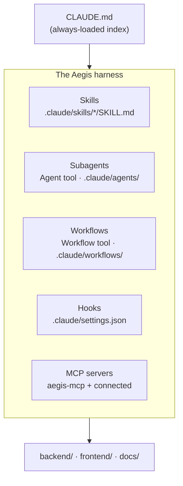

# Harness Engineering for Aegis

The **harness** is everything that shapes how a Claude agent behaves in this
repo *before it reads any application code*: the contents of `.claude/`, the
root `CLAUDE.md`, settings, and the runtime primitives the agent can reach
(subagents, workflows, hooks, MCP servers). The application is what Aegis *is*;
the harness is how Aegis is *built by agents*.

This doc is the reference for **changing the harness itself**. For how the
harness composes into a development process, read
[`adlc.md`](adlc.md) first — it tells you *which* primitive owns *which* phase.
This doc tells you how to build and maintain those primitives.

---

## The five primitives



| Primitive | Lives in | Loaded | Use it for |
|-----------|----------|--------|------------|
| **Skill** | `.claude/skills/<name>/SKILL.md` | On trigger phrase / `/<name>` | Reusable *procedure* with judgment — "how we do X here". |
| **Subagent** | built-in types, or `.claude/agents/<name>.md` | On `Agent` call | A *fresh-context* worker for a scoped job (search, plan, implement). |
| **Workflow** | `Workflow` tool, saved in `.claude/workflows/<name>.js` | On `/workflow` / `Workflow` call | *Deterministic* multi-agent orchestration (loops, pipelines, barriers). |
| **Hook** | `.claude/settings.json` (`hooks`) | Automatically on an event | *Automated* behavior the harness runs, not the model (SessionStart, pre/post tool). |
| **MCP server** | session config / `aegis-mcp` | On connect | *External capability* — data and actions beyond the filesystem. |

Pick the lowest-ceremony primitive that fits: a **skill** if you're encoding
judgment a human would, a **subagent** if you need a clean context window, a
**workflow** if the orchestration must be reproducible, a **hook** if it must
happen *every* time without the model deciding, an **MCP server** if you need to
reach outside the repo.

---

## Current Aegis harness (inventory)

What exists today, so you extend rather than duplicate:

| Primitive | Name | Triggers on | Owns |
|-----------|------|-------------|------|
| Skill | [`project-manager`](../.claude/skills/project-manager/SKILL.md) | "plan the team", "who builds X" | ADLC Plan + Improve: briefs, team sizing, cadence |
| Skill | [`multi-agent-orchestration`](../.claude/skills/multi-agent-orchestration/SKILL.md) | "orchestrate", "split across agents" | ADLC Build: model-driven Agent fan-out |
| Skill | [`frontend-design-team`](../.claude/skills/frontend-design-team/SKILL.md) | "redesign", "restyle", design handoff | ADLC Design + Build for *visual* work |
| Skill | [`aegis-troubleshooting`](../.claude/skills/aegis-troubleshooting/SKILL.md) | stack-up / build / auth bugs | Known-issue playbook (the Verify safety net) |
| Skill | [`workflow`](../.claude/skills/workflow/SKILL.md) | "run a workflow", "fan out", "pipeline" | Deterministic Build/Review/Improve orchestration |
| Subagent | `Explore` (built-in) | read-only fan-out search | "where is X", naming sweeps |
| Subagent | `Plan` (built-in) | architecture before impl | subsystem plans, contracts |
| Subagent | `general-purpose` (built-in) | everything else | implementers, QA, reviewers |
| Subagent | `claude-code-guide` (built-in) | Claude Code / SDK / API Qs | the AI engineer's reference |
| MCP | `aegis-mcp` (stdio) | `claude mcp add aegis` | 18 in-process tools over the same DB |
| MCP | github, Vercel, Mermaid, … | session connect | PRs/CI, deploys, diagram validation |

**Gaps (the harness roadmap):** no `.claude/agents/` custom subagents yet, no
`.claude/settings.json` (no hooks, no permission allowlist), no saved
`.claude/workflows/*.js`. See [Harness roadmap](#harness-roadmap).

---

## How to add each primitive

### Add a skill

A skill is a folder with a `SKILL.md`. The frontmatter is load-bearing — the
`description` is the *only* thing the model sees when deciding whether to trigger
it, so it must carry the trigger vocabulary.

```
.claude/skills/<name>/SKILL.md
```

```markdown
---
name: <kebab-name>           # must match the folder
description: <one sentence on what it does> Trigger when the user asks "<phrase>",
  "<phrase>", or <situation>. <Boundary vs. any overlapping skill.>
---

# <Title>

<When to invoke> / <When to skip>
<The procedure — tables, file paths, concrete steps>
<Anti-patterns>
```

**Rules that make a skill actually fire and behave** (learned from the four
existing skills):

- **Front-load trigger phrases** in `description`. The model matches on it; a
  vague description never triggers. Quote the literal phrases users say.
- **State the boundary** with any sibling skill. `frontend-design-team` and
  `multi-agent-orchestration` each name the other and say who's the parent when
  work blends — copy that pattern.
- **Be opinionated and concrete.** Name real files (`routers/budgets.py`,
  `globals.css`), real Make targets, real gates. Generic advice doesn't earn its
  context cost.
- **Include an anti-patterns section.** The existing skills all end with "❌ …"
  — it's where the hard-won "don't do this" lives.
- **Progressive disclosure.** Keep `SKILL.md` lean; push long reference material
  into sibling files in the skill folder and link to them.

### Add a custom subagent

Built-in types (`Explore`, `Plan`, `general-purpose`, `claude-code-guide`) cover
most needs — reach for a custom subagent only when a role recurs with a *fixed
system prompt and a narrowed toolset*. Define it as Markdown with frontmatter:

```
.claude/agents/<name>.md
```

```markdown
---
name: aegis-backend
description: FastAPI/SQLAlchemy/Alembic implementer for backend/app/. Use for
  router, model, schema, migration, and service work.
tools: Read, Edit, Write, Grep, Glob, Bash      # omit to inherit all
---

You are the Aegis backend engineer. You own `backend/app/`. You never touch
`frontend/src/`. Migrations are Alembic, reversible, batch-mode for SQLite.
Pydantic v2 schemas. Return a punch list of files changed.
```

A custom subagent's value is **lane-locking + a narrowed toolset**: a backend
agent that *can't* edit frontend files can't drift. The same name is resolvable
from both the `Agent` tool (`subagent_type`) and a `/workflow` script
(`agentType`).

### Add a workflow

Workflows are the deterministic counterpart to the orchestration skill — JS
scripts run by the `Workflow` tool. Author them with the
[`/workflow`](../.claude/skills/workflow/SKILL.md) skill, which documents the
full API (`agent`/`parallel`/`pipeline`/`phase`/`log`, `schema`, `budget`,
worktree isolation, resume). Saved scripts go in:

```
.claude/workflows/<name>.js
```

and become callable by name. Every script starts with a pure-literal `meta`
block. The `/workflow` skill carries four runnable Aegis examples
(`review-diff`, `migration-safety`, `feature-build`, `roadmap-triage`) — start
by copying the closest one.

> **Opt-in gate.** The `Workflow` tool only runs on explicit opt-in (the
> `ultracode` keyword, an explicit "run a workflow" ask, or a skill that calls
> it). Invoking the `/workflow` skill *is* that opt-in. Don't wire a workflow
> into a hook that fires unprompted.

### Add a hook

Hooks are how you make something happen **every time, deterministically** —
the harness executes them, the model doesn't choose to. Configure in
`.claude/settings.json`:

```json
{
  "hooks": {
    "SessionStart": [
      {
        "hooks": [
          { "type": "command", "command": "make migrate >/dev/null 2>&1 || true" }
        ]
      }
    ]
  }
}
```

The highest-value hook for Aegis is a **SessionStart** that guarantees a web
session can build and test — generate `.env` (`make setup`), run migrations,
seed. See the [`session-start-hook`](../.claude/skills/) skill for the full
recipe. Use the [`update-config`](../.claude/skills/) skill for any
`settings.json` change (permissions, env vars, hooks) rather than editing by
hand.

### Add / use an MCP server

Aegis ships its own: **`aegis-mcp`**, a stdio server exposing 18 tools over the
same database (see README → *MCP server*). It uses a local-trust model
(`AEGIS_USER_EMAIL` instead of a JWT) because it spawns as a child of the MCP
client. Add new tools there when an agent needs to *act on Aegis data*; add a
new external MCP server when an agent needs a capability outside the repo
(GitHub, Vercel, diagram rendering — all already connected this session).

---

## Conventions

These hold across every primitive:

- **Trigger-phrase discipline.** A skill that never fires is dead weight; one
  that fires too eagerly is noise. Tune the `description` until it matches
  exactly the situations you want and names its boundary with siblings.
- **Lane discipline / role-locking.** Backend → `backend/app/`, frontend →
  `frontend/src/`, design-system → `globals.css` only. Encode it in subagent
  prompts and enforce it in Review.
- **Trust but verify.** Read the diff an agent produced; don't take "done" on
  faith. A workflow that *finds* bugs should *adversarially verify* them before
  reporting.
- **Progressive disclosure.** Always-loaded context (`CLAUDE.md`) stays tiny and
  points outward. Depth lives in skills and docs, loaded on demand.
- **Minimal diff.** Harness changes are additive and reversible. A new skill
  doesn't rewrite an existing one; it names the boundary and links across.
- **No silent caps.** If a workflow bounds coverage (top-N, sampling, no-retry),
  `log()` what it dropped — silent truncation reads as "covered everything".
- **Pin the model only when sure.** Workflow agents inherit the session model;
  override per-agent only when a tier genuinely fits the stage.

---

## Decision table — "to do X, reach for Y"

| You want to… | Primitive |
|---|---|
| Encode "how we do X in Aegis" with judgment | **Skill** |
| Search the codebase broadly, read-only | `Explore` **subagent** |
| Plan a subsystem before building it | `Plan` **subagent** |
| Implement a scoped slice in a clean context | `general-purpose` **subagent** (or custom lane-locked one) |
| Fan out exploratory work where areas interact | **`multi-agent-orchestration` skill** |
| Run a *known list* through *fixed stages*, reproducibly | **`/workflow`** script |
| Make something happen on *every* session/tool event | **Hook** in `settings.json` |
| Let an agent read/write Aegis data or hit GitHub/Vercel | **MCP server** |
| Change permissions / env / hooks | **`update-config` skill** |
| Answer a Claude Code / SDK / API question | **`claude-code-guide` subagent** / `claude-api` skill |

---

## Testing & maintaining the harness

The harness is code; treat it like code.

- **Skills** — after editing a `description`, sanity-check it fires by paraphrasing
  the trigger and confirming the skill is offered. Keep examples runnable; stale
  file paths are the main rot.
- **Workflows** — they're resumable and idempotent by design. Iterate by editing
  the saved `.js` and re-invoking with `scriptPath` + `resumeFromRunId` (unchanged
  prefix returns cached). Validate the `meta` block is a pure literal.
- **Hooks** — test the command standalone first; a failing SessionStart hook
  degrades every session. Guard with `|| true` where a failure shouldn't block.
- **MCP** — `aegis-mcp` queries the live DB; run it against a seeded dev DB, never
  production, when testing new tools.
- **Mermaid in docs** — validate new diagrams with the Mermaid MCP before commit;
  a broken block is a visible defect.

---

## Harness roadmap

Concrete next steps to close the gaps, in priority order:

1. **`.claude/settings.json` + SessionStart hook** — guarantee web sessions can
   `make setup && make migrate && make test`. Highest leverage; use the
   `session-start-hook` skill.
2. **Lane-locked custom subagents** — `aegis-backend`, `aegis-frontend`,
   `aegis-ai`, `aegis-qa` under `.claude/agents/`, so Build fan-outs can't drift
   lanes by construction.
3. **Saved workflows** — promote the four example scripts in the `/workflow`
   skill into `.claude/workflows/*.js` so they're callable by name (e.g.
   `Workflow({name: "review-diff"})`).
4. **Permission allowlist** — run the `fewer-permission-prompts` skill to
   allowlist the common read-only `make`/`git`/`docker` calls.
5. **Harness CHANGELOG discipline** — note harness changes in `CHANGELOG.md`
   alongside app changes; the harness is part of the product's velocity.
