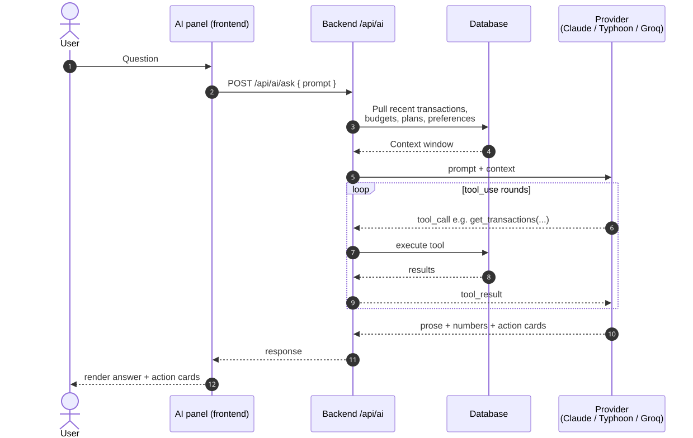

# 3 · Working with the AI assistant

Aegis ships with an AI panel that can answer questions about *your* money in plain English. It's not a chatbot — it's an analyst with read access to your transactions, plans, and budgets, and tool-call access to the same APIs the dashboard uses.

This tutorial covers what to ask, how to read the answers, and what the AI can't do.

## Is it on for you?

The AI is opt-in at the deployment level. If you don't see the **⌘\\** chip in the status bar (or the AI panel slot in the right edge of the layout), your operator hasn't configured an AI key. Three providers are supported:

- **Anthropic Claude** — default, highest quality on analysis questions.
- **Typhoon** — OpenAI-compatible Thai-language-optimized model.
- **Groq** — fast Llama 3.3 inference, lowest latency, somewhat lower analysis quality.

Provider choice and key live in the backend's `.env`. Switching providers does **not** invalidate any conversation history (there isn't any persisted across sessions yet).

## Opening the AI panel

`⌘\\` toggles the panel. Or click the **AI** chip in the status bar bottom-right.

The panel has two tabs:

- **Ask** — free-form chat. Each question runs against your data.
- **Recommendations** — pre-computed suggestions the AI surfaces from background analysis (budget-tightening ideas, savings opportunities). These refresh on demand, not on a schedule.

## What to ask

The AI does well at:

- **Trends across time** — "Compare my dining spending this quarter to the same quarter last year." It will pull both windows, compute the delta, and explain the most-changed weeks.
- **Anomaly investigation** — "Why did groceries spike in March?" It pulls the March transactions, sorts by amount, and points at the outliers.
- **Plan feasibility** — "Can I save $5 000 by August?" It looks at your recurring income, recurring expenses, current savings rate, and gives a binary answer + a path to get there.
- **Recommendations grounded in numbers** — "Where could I cut $200 a month?" It ranks categories by variance + amount and proposes 2–3 specific subscriptions or recurring expenses.

The AI does poorly at:

- **Anything outside your data** — it doesn't know your job, your goals, your tax bracket, or what cryptocurrency is worth today. Don't ask "should I sell my Tesla shares?" — it has no market data.
- **Future projections with high precision** — its forecasts are based on your past 90 days. Be skeptical of any "by exact date" answer.
- **Bookkeeping corrections** — "Move all my Starbucks expenses to category 'coffee'" won't work; the AI is read-only. Use the bulk-edit UI.
- **Long, multi-step plans** — keep questions to one analysis at a time. "What are my five biggest unnecessary recurring charges, and how do I cancel each one?" is two questions — split them.

## How the AI sees your data

Diagram source: [tutorials-03-using-the-ai-assistant-how-the-ai-sees-your-data.mmd](../diagrams/src/tutorials-03-using-the-ai-assistant-how-the-ai-sees-your-data.mmd)

When you ask a question, the backend:

1. Pulls a context window: your recent transactions, active budgets, active plans, account preferences.
2. Sends it inline with your question to the configured AI provider.
3. The provider may call tool-defined functions (`get_transactions(start, end, category)`, `get_budget_status(category)`, etc.) for more data on demand.
4. Returns the response.

This means:

- **Only data already in Aegis is visible** — the AI doesn't fetch your bank account live. Import a CSV first (tutorial 2).
- **Free-text fields can influence the AI** — descriptions, tag names, and category strings are all in the prompt. Don't put anything in a transaction description you wouldn't want the AI provider to log.
- **The AI sees ALL your data on every question** — not just the question subject. Privacy and provider data-retention policy matter; Anthropic's API does not train on your prompts by default, but if your operator switched providers, check their policy.

## Reading the response

Each AI response has up to three parts:

1. **Prose answer** — natural language, 2–8 sentences.
2. **Numbers callout** — bold-formatted key figures so you can skim.
3. **Action cards** — clickable suggestions. Clicking one navigates you to the relevant page with the right filters pre-applied. E.g. an action card saying "review your dining transactions in March" jumps you to `/transactions?category=dining&start=2026-03-01&end=2026-03-31`.

If the AI says "I don't have enough data," it usually means you have fewer than 30 days of transactions in the relevant category. Import more history or wait a few weeks.

## When the AI is unsure

Watch for these tells in the response:

- **"Approximately"** / **"around"** / **"in the range of"** — the AI is hedging. Drill into the underlying numbers via the transactions page before acting.
- **"Based on your data"** — soft disclaimer; usually fine.
- **"I cannot determine"** — hard refusal. The data isn't there. Either the category doesn't exist, the date range is empty, or the question requires market/external information.

## Recommendations tab

The Recommendations tab is a periodic-refresh report, not a chat. It surfaces:

- Categories where you're at or near your budget ceiling.
- Recurring charges flagged as candidates for cancellation (price-rose, low usage proxy).
- Savings-rate observations.
- Plan progress: which plans you're behind on.

Each card has a dismiss button and a "tell me more" button. Dismissing hides it for 30 days; "tell me more" sends a follow-up to the Ask tab pre-filled with the right question.

## Rate limits + cost

The AI is metered:

- **Per IP**: 20 requests per minute (configurable in backend `RATE_LIMIT_PER_MINUTE`).
- **Per provider**: subject to the provider's own quotas + your account's billing.
- **Per request token usage**: Aegis caps the context window at ~30 transactions in summary form. Heavy users may notice that very-historical questions get summarized rather than enumerated.

If you self-host and worry about cost: switch the provider to Groq (it has a free tier), or set `AI_PROVIDER=` blank to disable the AI panel entirely without breaking the rest of the app.

**You no longer have to guess what it costs.** Settings → Preferences shows an **AI Usage** card with metered token counts per model and an estimated cost. Token counts are measured off the provider's own response; the cost is derived from provider-published prices where available (Groq publishes them) and otherwise from a table stamped with the date it was captured. A model neither source prices is shown with its usage and no cost, rather than a made-up number.

For calibration: one `analyze` call on Groq `llama-3.3-70b-versatile` measures ≈ 415 input / 152 output tokens, about **$0.00036** — roughly $0.36 per thousand calls.

The same screen lets you switch models and store the provider key encrypted server-side, without a redeploy. See [`docs/design/006`](../design/006-ai-provider-configuration.md).

## Troubleshooting

**"AI provider not configured"** — no credential is available. Aegis resolves the key as *stored secret → `.env`*, so either store one under Settings → Preferences → Provider API Key, or set `ANTHROPIC_API_KEY` (or the Typhoon / Groq equivalent) in `.env`. Operator setup, not a user issue.

**"Rate limit exceeded"** — wait a minute. Aegis enforces 20/min/IP on AI endpoints separately from the general rate limit.

**"The model refused the question"** — usually because the question contains personally-identifying info that triggered the provider's safety filter. Re-phrase without names.

**Empty Recommendations tab** — you have fewer than 14 days of data or fewer than 5 transactions per active category. The AI won't fabricate recommendations.
