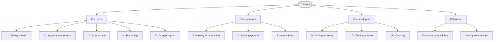

# Aegis Tutorials

Hands-on guides for getting work done with Aegis. Each tutorial is a self-contained walkthrough you can finish in under 30 minutes.

## For users

1. [**Getting started in 10 minutes**](./01-getting-started.md) — register, add your first transaction, set a budget, and read your dashboard. Start here if you've just deployed Aegis or signed up.
2. [**Importing a year of transactions from your bank**](./02-import-transactions.md) — export a CSV from your bank, preview the column mapping, fix mistakes, and bulk-insert. Covers the import preview / confirm flow.
3. [**Working with the AI assistant**](./03-using-the-ai-assistant.md) — what the AI can answer, how to phrase questions for good results, how to read its anomaly + recommendation cards, and the limits of what it sees.
4. [**Planning a trip with the Gantt + Trips view**](./04-planning-a-trip.md) — create a trip, attach a budget, link transactions, and watch the burn-down over time.
5. [**Setting up Google sign-in**](./05-google-sign-in.md) — the user-side flow plus what to do if you got locked out / want to link a Google account to an existing email/password user.

## For operators

6. [**Deploying Aegis to production**](./06-deploy-production.md) — the deploy-day runbook: env vars, migrations, first-run checks, monitoring, backups.
7. [**Setting up Stripe payments**](./07-stripe-payments.md) — going from "I have a Stripe account" to a working `/payments` page with test-mode → live-mode promotion.
8. [**Configuring AI providers**](./08-ai-providers.md) — Anthropic vs Typhoon vs Groq, model selection, cost-cap suggestions, switching providers without losing user history.

## For developers

9. [**Adding a new entity (end-to-end)**](./09-adding-an-entity.md) — backend model + Alembic migration + router + Pydantic schema + frontend API client + page + nav entry, using a worked example.
10. [**Writing a tested router**](./10-testing-a-router.md) — fixture pattern in `backend/tests/`, how to mock auth, how to mock external services (Stripe / Anthropic).
11. [**Caching — what's cached, what isn't, how to add more**](./11-caching.md) — the pluggable cache layer, invalidation patterns, when to use Redis vs the in-memory default, sizing.

## Reference

- [**Database compatibility matrix**](../databases.md) — full matrix of every relational DB Aegis runs against, required URL params, pool tuning per provider, what's explicitly NOT supported.
- [**Deployment recipes**](../deployment/) — per-platform guides (Vercel + Neon, AWS, GCP, self-hosted Docker).
