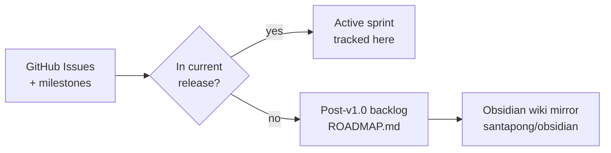
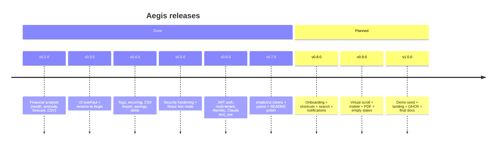

# Plan

Release-by-release scope lives in [ROADMAP.md](ROADMAP.md). Full release
history is in [CHANGELOG.md](CHANGELOG.md). This file is a short note on how
the backlog is tracked.

## Tracking

- Each feature in the current release (v0.8.0 and v0.9.0) has a GitHub Issue
  with a milestone. Progress is visible on the repo's Issues tab.
- Medium-priority work that is not yet scheduled is listed under
  "Post-v1.0 backlog" in `ROADMAP.md`.
- Obsidian wiki mirror: `santapong/obsidian:wiki/plans/aegis-next.md`.

## Release flow

## Completed (see CHANGELOG for details)

- v0.2.0 — financial analysis (health score, anomaly, forecast, CSV export).
- v0.3.0 — UI overhaul and rename to Aegis.
- v0.4.0 — tags, recurring transactions, CSV import, savings goals, debt tracker.
- v0.5.0 — security hardening, Stripe test-mode integration.
- v0.6.0 — JWT auth, multi-tenant, Alembic migrations, Claude `tool_use`.
- v0.7.0 — shadcn/ui token migration, pytest smoke harness, README / .env.example polish.

## Currently planned

- **v0.8.0** — onboarding tour, keyboard shortcuts, transaction full-text search, in-app notifications.
- **v0.9.0** — virtual scrolling, mobile polish, PDF export, empty-state / skeleton / 404 polish.
- **v1.0.0** — demo seed, landing page, GHCR image, final docs.
